第1章 DBを準備しよう
=====

[↑目次](../README.md "目次")

まずは、今回作成するアプリが使用するデータベース（以下DB）の準備をしていきましょう。

## 1.1 開発用ユーザー作成

業務アプリを開発する際、目的に応じてDBのスキーマを作成するのが通例となっています。例えば、開発用、結合テスト用、受入テスト用、本番用という感じです。テーブルを始めとしたDBのオブジェクトは、開発および保守機関を通じて変化、成長するため、アプリのバージョンと同様に、DBもしっかりとバージョン管理する必要があるためです。

今回使用するOracleは、スキーマがほぼユーザーと同じ意味になりますので、新たに開発用のユーザーを作成します。この時気を付けなければならないことがあります。それは「適切な権限を付与しないといけない」ということです。

テキスト学習では簡便さを確保するため、作成したユーザーにはDBA権限を付与してしまうケースも少なくありません。しかし、DBA権限とは、その気になればDB自体を削除することもできてしまう危険な権限です。このような「何でもできる」権限を、普段使いするのは避けなければいけません。

ではどうするかといえば「必要最小限の権限を付与する」ことです。これを「最小権限の原則」といい、DBだけでなくありとあらゆるシステムの設計の基本的な原則の一つです。今回作成するユーザーであれば、「自らのスキーマにテーブル等のオブジェクトを作成、変更、削除できる」権限だけあれば良いはずです。

以上を踏まえ、今回作成するユーザーのDDLは次のようになります。

**リスト 1-1** ユーザー作成DDL（MRRS_DEV.sql）

```sql
-- ユーザー作成
CREATE USER MRRS_DEV
IDENTIFIED BY MRRS
DEFAULT TABLESPACE USERS
TEMPORARY TABLESPACE TEMP
PROFILE DEFAULT
QUOTA UNLIMITED ON USERS
/

-- 権限付与
GRANT CREATE SESSION TO MRRS_DEV
/
GRANT CREATE PROCEDURE TO MRRS_DEV
/
GRANT CREATE SEQUENCE TO MRRS_DEV
/
GRANT CREATE TABLE TO MRRS_DEV
/
GRANT CREATE TRIGGER TO MRRS_DEV
/
GRANT CREATE TYPE TO MRRS_DEV
/
GRANT CREATE VIEW TO MRRS_DEV
/
```

まずユーザーを作成します。ユーザーの名前は、「会議室予約システム（*M*eeting *R*oom *R*eservation *S*ystem）の開発（*Dev*elopment）用」を表す`MRRS_DEV`にします。使用する表領域などは最も基本的なもの（デフォルトを`USERS`、一時を`TEMP`）にしていますが、システムの要件によっては、独自の専用の表領域を使う場合もあります。また、プロファイルも既定（`DEFAULT`）を指定しています。そして、作成するユーザーが使用できる`USERS`表領域の最大サイズを`UNLIMITED`（制限なし）にします。

次に、作成したユーザーにシステム権限を付与します。DB接続できなければ話になりませんので`CREATE SESSION`は必須です。その他、スキーマのDBオブジェクトを作成（および変更、削除）するために必要な各種の'CREATE xxx`システム権限を付与します。今回のサンプルではストアド・プロシージャ及びトリガー、ビューは使いませんが、一般的な業務システムではよく使うので、それに倣い権限を付与しています。

上記のDDLを、SQL\*Plusを使いDBAとしてログインして実行します。今回はデスクトップにMRRS_DEV.sqlファイルがあるとします。

```terminal
C:\Users\xxx>sqlplus / as SYSDBA

SQL*Plus: Release 12.2.0.1.0 Production on 金 5月 26 09:52:53 2017

Copyright (c) 1982, 2016, Oracle.  All rights reserved.


Oracle Database 12c Enterprise Edition Release 12.2.0.1.0 - 64bit Production
に接続されました。
SQL> @.\Desktop\MRRS_DEV.sql

ユーザーが作成されました。


権限付与が成功しました。


権限付与が成功しました。


権限付与が成功しました。


権限付与が成功しました。


権限付与が成功しました。


権限付与が成功しました。


権限付与が成功しました。

SQL> quit
Oracle Database 12c Enterprise Edition Release 12.2.0.1.0 - 64bit Productionとの接続が切断されました。

C:\Users\xxx>
```

## 1.2 SI OBJECT BROWSERを使ったユーザー作成

DDLを実行する他にも、GUIツールを使ってユーザーを作成することもできます。ここでは一例として、[システムインテグレータ社](https://www.sint.co.jp/)のOracle Database用GUIツール「[SI OBJECT BROWSER for Oracle](https://products.sint.co.jp/siob/products/oracle)」を使ったユーザー作成方法を紹介します。

### 1) SYSTEMユーザーで接続する

DB自体に関する変更を加えるので、`SYSTEM`ユーザーで接続します。この時、［接続モード］は`SYSDBA`ではなく`NORMAL`で構いません。

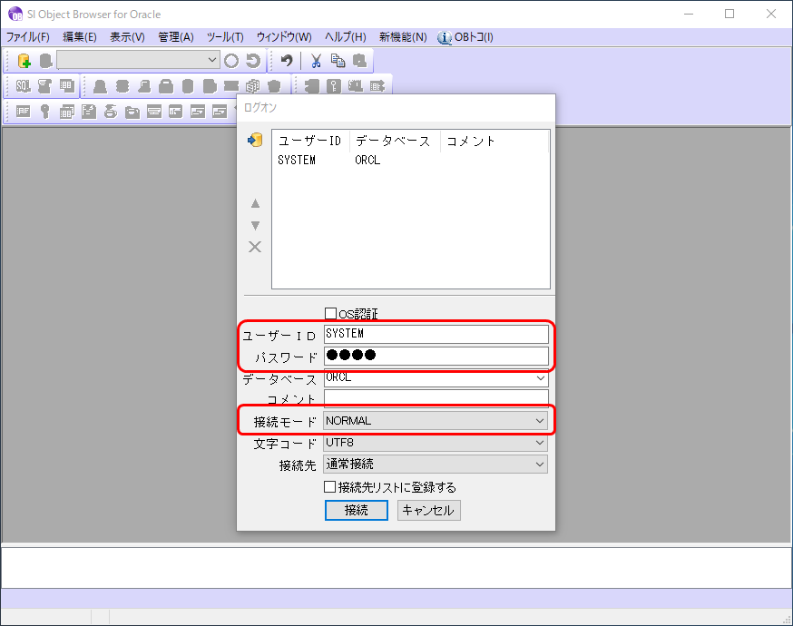

### 2) ユーザー情報を表示する

ツールバーより［ユーザー情報］アイコンをクリックしてユーザー情報を表示します。

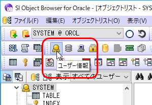

### 3) ユーザーを作成する

［ユーザー］タブを表示したまま、［新規］ボタンをクリックします。

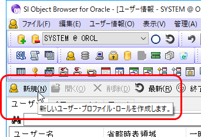

ユーザー情報を次のように設定して［作成］ボタンをクリックする。

- 名前 : `MRRS_DEV`
- 定義情報
    - パスワード : 任意の値（ここでは"MRRS"）
    - デフォルト表領域 : `USERS`
    - テンポラリ表領域 : `TEMP`
    - プロファイル  : `DEFAULT`
    - 表領域
        - USERS
            - サイズ : `UNLIMITED`
- システム権限 : 以下にチェックを入れる
    - CREATE PROCEDURE
    - CREATE SEQUENCE
    - CREATE SESSION
    - CREATE TABLE
    - CREATE TRIGGER
    - CREATE TYPE
    - CREATE VIEW

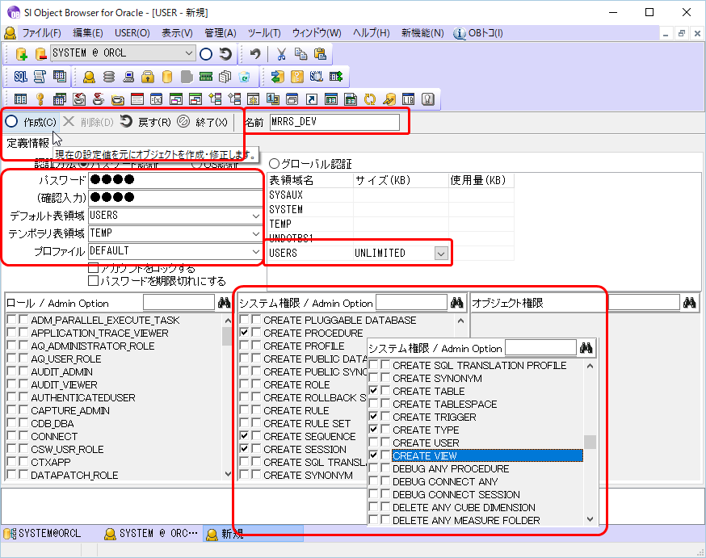

## 1.3 テーブル作成

機能仕様書のデータモデルを元に設計した「場所」、「会議室」、「予約」の各テーブルを、各種の制約とともに作成します。

テーブルは`MRRS_DEV`スキーマに作成します。事前にSQL*PlusでMRRS_DEVユーザーを使い、次のように接続しておきましょう。

```
C:\>sqlplus MRRS_DEV/MRRS
```

### 1) 場所

場所テーブルはプライマリキー制約の他、「場所が重複してはいけない」というユニーク制約が必要です。作成するには次のDDLを実行します。

**リスト 1-2** 場所テーブル作成DDL（LOCATION.sql）

```sql
CREATE TABLE LOCATION
(
    ID                             NUMBER NOT NULL,
    NAME                           NVARCHAR2(20) NOT NULL,
    CONSTRAINT PK_LOCATION PRIMARY KEY (ID),
    CONSTRAINT UK_LOCATION UNIQUE (NAME)
)
/
COMMENT ON TABLE LOCATION IS '場所'
/
COMMENT ON COLUMN LOCATION.ID IS 'ID'
/
COMMENT ON COLUMN LOCATION.NAME IS '名称'
/
```

なお、意味としては「名称」列がキー項目になり得ますが、名称は後で変更される恐れもあるため、代理キーとしてID列を設けています。このままだと名称が重複したレコードが存在し得るため、ユニーク制約を付けることでそれを防ぎます。

DDLは先ほど作成した`MRRS_DEV`ユーザーでログオンして実行します。

```terminal
C:\Users\takano-s>sqlplus MRRS_DEV/MRRS

SQL*Plus: Release 12.2.0.1.0 Production on 金 5月 26 10:44:34 2017

Copyright (c) 1982, 2016, Oracle.  All rights reserved.


Oracle Database 12c Enterprise Edition Release 12.2.0.1.0 - 64bit Production
に接続されました。
SQL> @.\Desktop\LOCATION.sql

表が作成されました。


コメントが作成されました。


コメントが作成されました。


コメントが作成されました。
```

もしくは、ユーザーの時と同様に、SI OBJECT BROWSER等のGUIツールで作成する方法もあります。実際にやってみましょう。

まず、`MRRS_DEV`ユーザーで接続しなおします。このとき［接続先リストに登録する］にチェックを入れておくと、次回以降上のリストから選択して接続できるようになるのでお勧めです。


接続出来たら、ツールバーの［新規テーブル］ボタンをクリックします。


［名前］に"LOCATION"を入力し、［提示情報］タブにて［項目名］～［コメント］をテーブル設計書を元に入力し、［作成］ボタンをクリックしてテーブルを作成します。

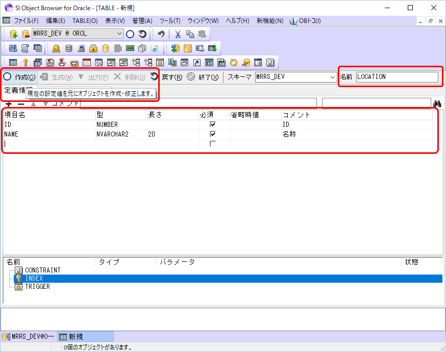

テーブルが作成出来たら、次は制約を追加していきます。まずはプライマリキー制約です。画面下のグリッドにて、［CONSTRAINT］を右クリックし、［新規作成］を選択します。

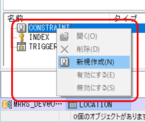

まず、［名前］に"PK_LOCATION"を入力します。次に［タイプ］が［PRIMARY KEY］であることを確認し、［テーブルの列］から［ID］列を選択して左向き三角ボタンをクリックします。すると［インデックスの列］に選択した［ID］列が追加されるので、［作成］ボタンをクリックしてプライマリキー制約を作成します。

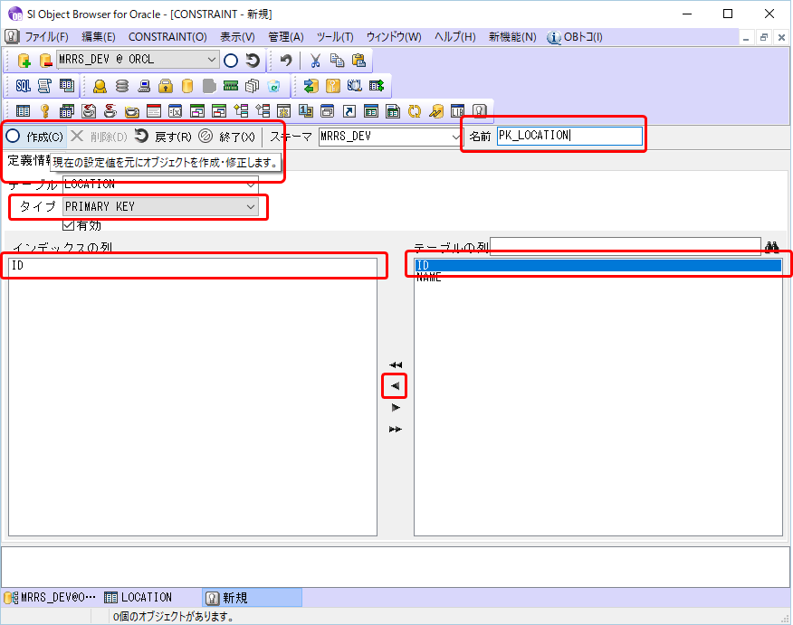

画面下のタブから［LOCATION］を選択して場所テーブルの定義情報を表示し、`F5`キーを押して更新すると、［CONSTRAINT］に［PK_LOCAION］プライマリキー制約が追加されたのが確認できます。

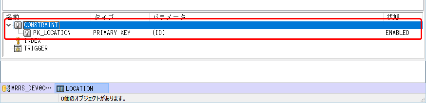

同様の手順で、今度は一意制約を追加します。［名前］に"UK_LOCATION"を入力したら［タイプ］で［UNIQUE KEY］を選択し、［インデックスの列］に［NAME］列を追加して作成します。

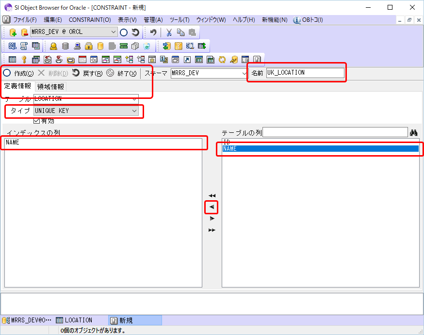

場所テーブルの定義を更新すると、［CONSTRAINT］に［UK_LOCATION］一意制約が追加されたのが確認できます。

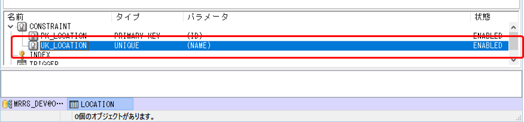

以上でテーブルの作成は終わりです。［ソース］タブを選択すると、作成したテーブルのDDLを確認できます。なお、SI OBJECT BROWSERの既定の設定では余分な領域情報も含まれてしまうので、［ツール］メニューの［オプション］から、［定義情報］－［SQL文に領域情報を含める］のチェックを外しておきましょう。

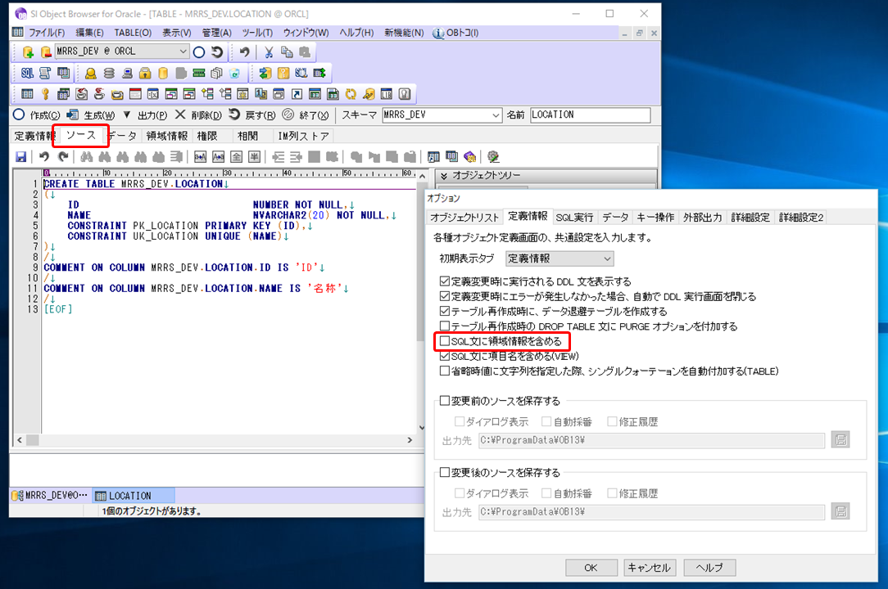

### 2) 会議室

場所と同様に以下のDDLを実行します。

**リスト 1-3** 会議室テーブル作成DDL（MEETING_ROOM.sql）

```sql
CREATE TABLE MEETING_ROOM
(
    ID                             NUMBER NOT NULL,
    LOCATION_ID                    NUMBER NOT NULL,
    NAME                           NVARCHAR2(20) NOT NULL,
    CONSTRAINT PK_MEETING_ROOM PRIMARY KEY (ID),
    CONSTRAINT FK_MEETING_ROOM_LOCATION FOREIGN KEY (LOCATION_ID) REFERENCES LOCATION (ID),
    CONSTRAINT UK_MEETING_ROOM UNIQUE (LOCATION_ID, NAME)
)
/
COMMENT ON TABLE MEETING_ROOM IS '会議室'
/
COMMENT ON COLUMN MEETING_ROOM.ID IS 'ID'
/
COMMENT ON COLUMN MEETING_ROOM.LOCATION_ID IS '場所ID'
/
COMMENT ON COLUMN MEETING_ROOM.NAME IS '名称'
/
```

同じ場所に同じ名前の会議室が登録できないよう、場所IDと名称に対して一意制約を付けています。
また、場所ID列には場所テーブルに存在しないIDを設定できないよう、外部キー制約を追加しています。これにより、存在しない場所IDが設定できなくなるとともに、会議室テーブルで使われた場所テーブルのレコードも消せなくなり、データの整合性が保たれます。

ファイルを使ったSQLの実行はSQL\*Plusからだけでなく、SI OBJECT BROWSERからも行えます。実際にやってみましょう。

まず、ツールバーの［スクリプト実行］ボタンをクリックします。

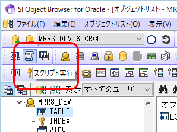

実行したいDDLファイル［MEETING_ROOM.sql］を右側の［ファイルの場所］から選択し、［<<］ボタンを押して左側の実行対象ファイルに追加します。その後［実行］ボタンをクリックすることで、DDLファイルを実行できます。

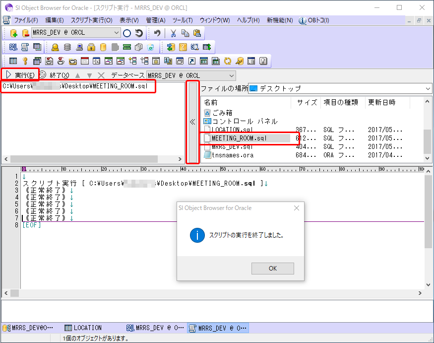

なお、サンプルのDDLファイルの文字コードは`UTF-8`のため、既定の設定のまま実行すると文字化けします。［ツール］メニューの［オプション］－［外部出力］タブにて、［ファイル入出力］－［テキストファイルの形式］を［UTF-8］に変更してから実行するようにしてください。

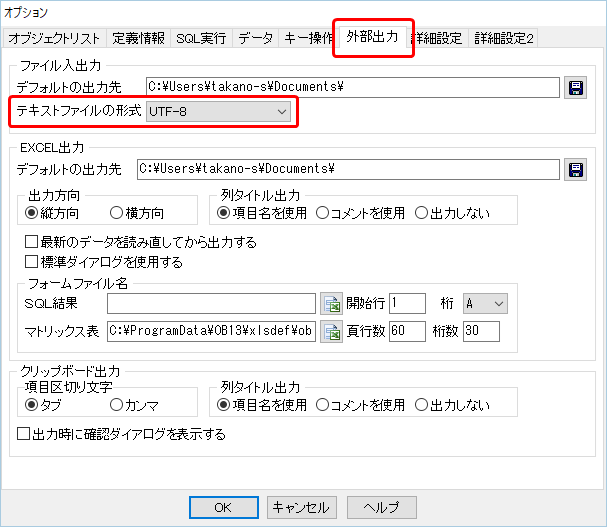

### 3) 予約

場所、会議室と同様に以下のDDLを実行します。

**リスト 1-4** 予約テーブル作成DDL（RESERVATION.sql）

```sql
CREATE TABLE RESERVATION
(
    ID                             NUMBER NOT NULL,
    MEETING_ROOM_ID                NUMBER NOT NULL,
    RESERVATION_START_DATE         DATE NOT NULL,
    RESERVATION_END_DATE           DATE NOT NULL,
    USER_NAME                      NVARCHAR2(50) NOT NULL,
    CONSTRAINT PK_RESERVATION PRIMARY KEY (ID),
    CONSTRAINT FK_RESERVATION_MEETING_ROOM FOREIGN KEY (MEETING_ROOM_ID) REFERENCES MEETING_ROOM (ID),
    CONSTRAINT UK_RESERVATION UNIQUE (MEETING_ROOM_ID, RESERVATION_START_DATE)
)
/
COMMENT ON TABLE RESERVATION IS '予約'
/
COMMENT ON COLUMN RESERVATION.ID IS 'ID'
/
COMMENT ON COLUMN RESERVATION.MEETING_ROOM_ID IS '会議室ID'
/
COMMENT ON COLUMN RESERVATION.RESERVATION_START_DATE IS '予約開始日時'
/
COMMENT ON COLUMN RESERVATION.RESERVATION_END_DATE IS '予約終了日時'
/
COMMENT ON COLUMN RESERVATION.USER_NAME IS '利用者'
/
```

会議室テーブルと同様、同じ会議室に同じ開始日時の予約が登録できないよう、会議室IDと予約開始日時に対して一意制約を付けています。なお、予約開始時間が異なるが期間が重なるデータについては、DB側で制約を付けるのが難しいため、アプリケーションの機能で担保することにします。
また、会議室IDには会議室テーブルへの外部キー制約も付け、会議室テーブルに存在しないデータを登録できず、予約テーブルに登録された会議室は削除できなくします。

## 1.4 シーケンス作成

最後に、各テーブルのID列の値を生成するのに使うシーケンスを作成します。

### DDLの実行

テーブルなどと同様にDDLを実行して作成します。例えば、場所テーブル用、会議室テーブル用のDDLは次のようになります。

**リスト 1-5** 場所テーブルのID列用シーケンス作成DDL（SEQ_LOCATION_ID.sql）

```sql
CREATE SEQUENCE SEQ_LOCATION_ID
INCREMENT BY 1
NOMAXVALUE
NOMINVALUE
NOCYCLE 
CACHE 20
NOORDER 
/
```

**リスト 1-6** 会議室テーブルのID列用シーケンス作成DDL（SEQ_MEETING_ROOM_ID.sql）

```sql
CREATE SEQUENCE SEQ_MEETING_ROOM_ID
INCREMENT BY 1
NOMAXVALUE
NOMINVALUE
NOCYCLE 
CACHE 20
NOORDER 
/
```

### SI OBJECT BROWSERで作成

テーブル等と同様にSI OBJECT BROWSERからも作成できます。

まず、ツールバーの［新規シーケンス］ボタンをクリックします。

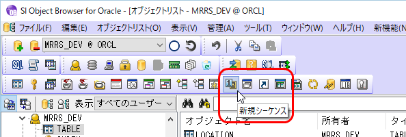

［名前］に"SEQ_RESERVATION_ID"を入力し、後の項目は以下の既定値のまま、［作成］ボタンをクリックします。

- 初期値 : 1
- 範囲
    - 最小 : なし（NoMinValue）
    - 最大 : なし（NoMaxValue）
- 増分 : 1
- 繰り返し : なし
- 順序保証 : なし
- キャッシュサイズ : 20

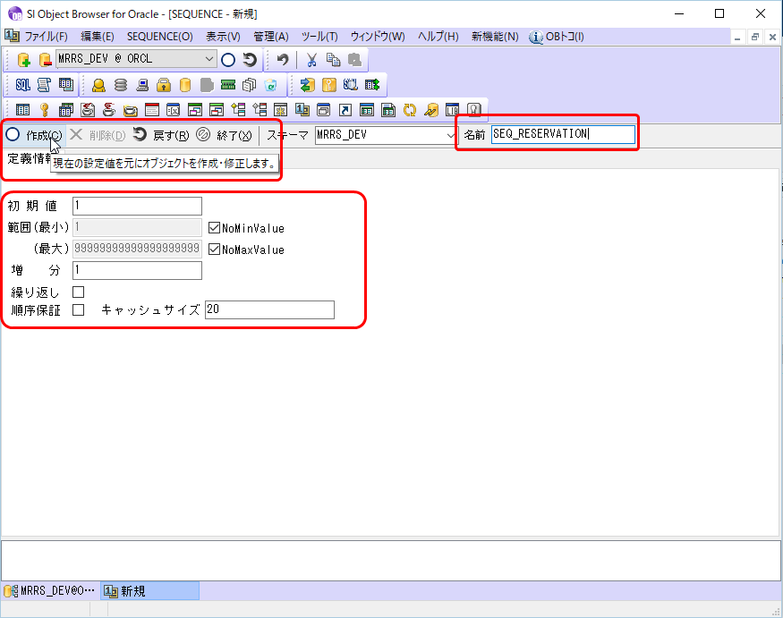

以上でアプリで使用するDBの準備が整いました。次の章から、順にアプリを作成していきましょう。

[→第2章 ソリューションを作成しよう](02.md)
