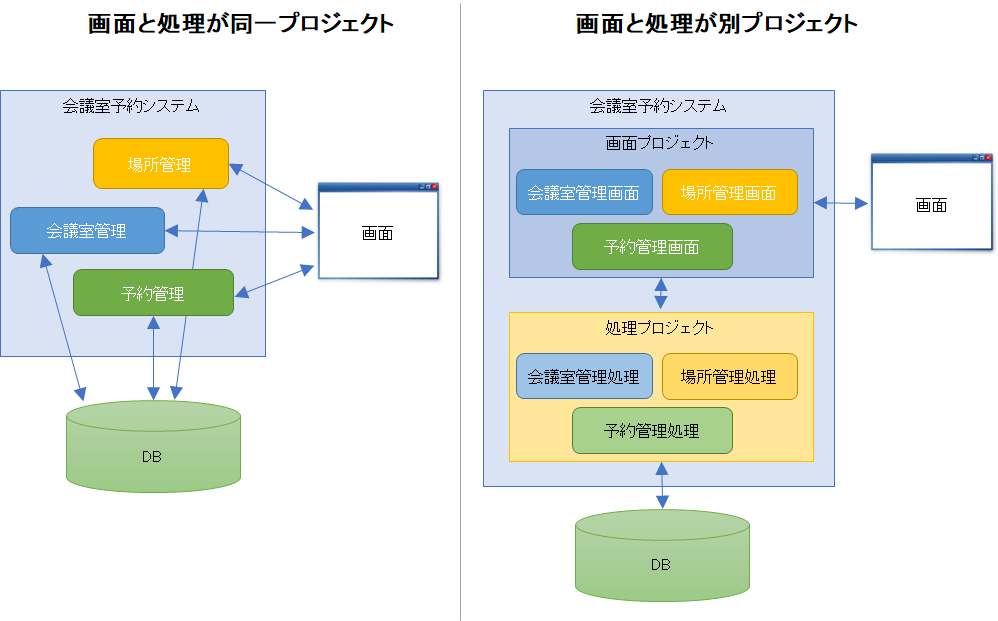
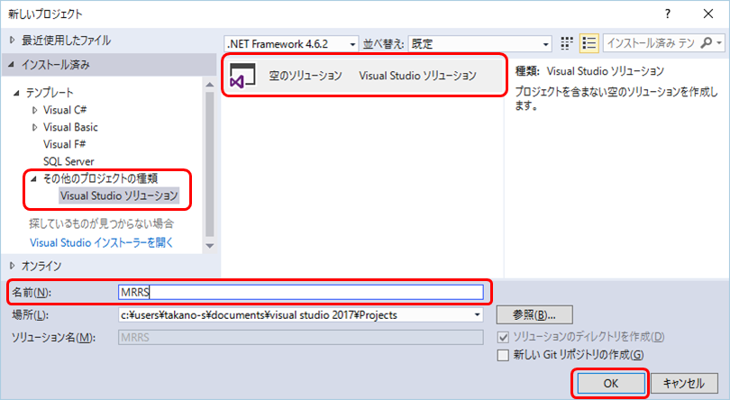
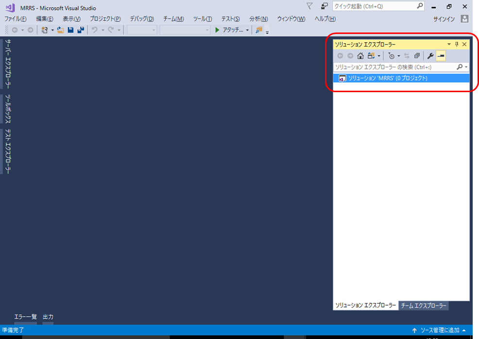
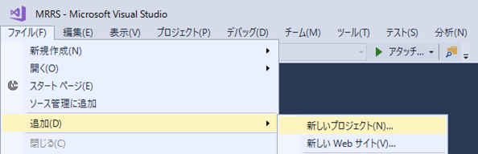
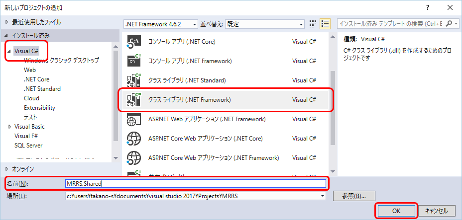
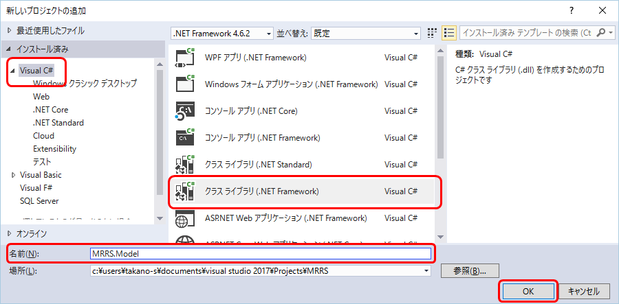
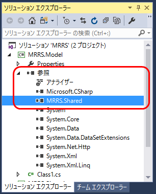
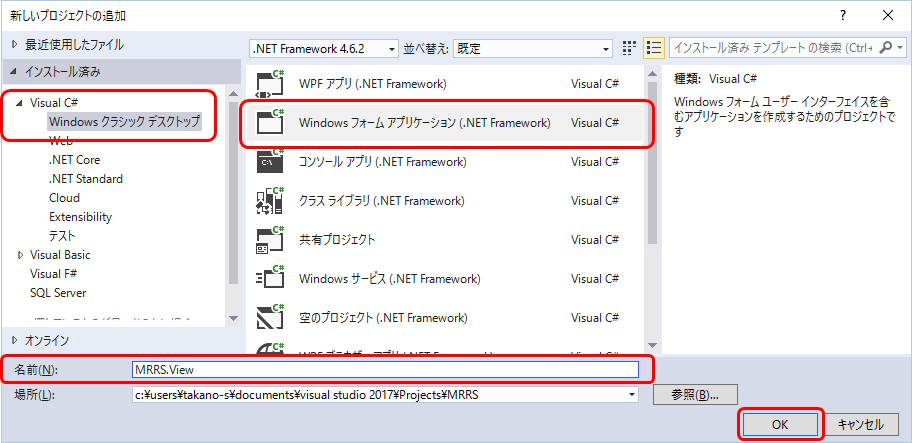
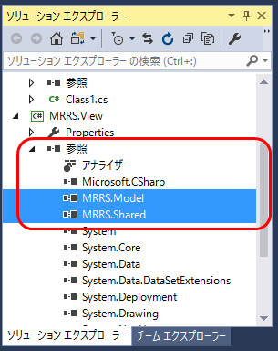
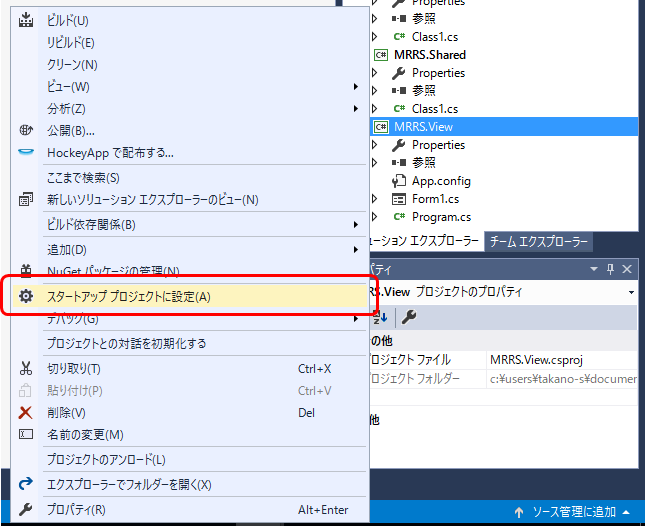

第2章 ソリューションを作成しよう
=====

[↑目次](../README.md "目次")

[←第1章 DBを準備しよう](01.md)

DBが準備できたのでアプリ作成に入りましょう。まずは、ソリューション並びに必要なプロジェクトを作成します。

## 2.1 ソリューション構成を考えよう

実際にアプリを作成し始める前に、今回のアプリに必要なソリューション構成について考えてみましょう。今回作成するのは、会議室を予約するという一見シンプルなアプリです。規模を考えれば、単一のWindowsフォームアプリケーションプロジェクトが1つだけあれば作成できる大きさです。

しかし、業務でアプリケーションを作成する場合、話はそう単純ではありません。業務アプリ開発には次のような特徴から、適宜アプリをいくつかのプロジェクトに分けて作成したほうが良いのです。

1. 開発は複数人で行う  
個人開発と異なり業務アプリは複数人で開発することになります。したがって、ある程度のルールやガイドラインなしに各人が勝手に作業をしていれば、いつか開発は破綻します。

2. 継続して保守される  
業務アプリの寿命は長く、最低でも数年間は使われます。その間、必要に応じて機能が修正、変更、削除、追加されることになります。もし単一のプロジェクトだけでアプリが構成されていると、どこに何が書いてあるのかがわからなくなるとともに、「何でもできる」ので処理が複雑に絡み合い、いわゆる「スパゲティコード」になるリスクが高いのです。

では、どのようなソリューション構成とすればよいのでしょうか。その基本は「責務の分割」と「1方向の参照関係」です。

### 責務の分割

実践的なプログラミングの最も基本的なルールが「責務の分割」です。簡単に言えば「1つのことをするのは1人に任せる」ことを徹底することです。言い換えると、「1つの機能の変更で影響を受けるものを1つにする」ということでもあります。

具体的な例を考えてみましょう。アプリケーションにはユーザに見せる画面とその内部で行われる処理があります。「画面の見た目」は、ユーザーの要望によりころころ変わりやすく、開発フェーズ、保守フェーズを通じて常に変化にさらされます。その反面、内部の処理は画面ほどには変わりません。この時、画面と処理が1つのプロジェクトになっていると、画面の変更によって本来関係がない処理を含むプロジェクトが頻繁に変更されてしまいます。

また、画面をどのように見せるかは時代によって変わりがちですが、処理はビジネスの要件が変わらなければ不変です。画面と処理がくっついていると、画面をモダンなものに置き換える必要があっても、処理が密接に絡み合って引き離すことができず、ずっと古いテクノロジーを使い続けなければならなくなってしまいます。

そのようなことを避けるために、「画面」に関するコードと「処理」に関するコードは、別プロジェクトに分けることが望ましいです。これを「プレゼンテーションとドメインの分離（PDS：Presentation Domain Separation）」と言います。処理が分かれていれば、その部分だけ再利用できたり、、そのまま利用できなくとも画面に関する余計な処理がないため、処理を再現したり「コード変換」できたりする可能性が高くなります。

### 1方向の参照関係

画面と処理で2つにプロジェクトを分けたとしてもまだ十分ではありません。アプリのコードの中には、画面でも処理でも使うものがあるからです。こういったコードを画面、処理のどちらかのプロジェクトに置いておくと、「画面が処理を参照し、処理が画面を参照する」という「循環参照」が出来上がってしまいます。循環参照があると、そのアプリをビルドすることができなくなることもあり、非常に危険です。

これを解決するには、画面と処理の共通部分を、そのまま共通部分としてさらに別プロジェクトに切り出し、画面と処理のプロジェクトからそれぞれ参照させるようにします。こうすることで、参照関係が「画面→共通←処理」のように、共通部分に向かう1方向だけになります。

以上を踏まえ、今回のサンプルでは、以下のようなソリューション構成にします。

- MRRSソリューション
    - MRRS.View   画面に関するプロジェクト
    - MRRS.Shared 共通部分に関するプロジェクト
    - MRRS.Model  処理に関するプロジェクト

なお、今回のこの分割方法は唯一絶対の基準ではないことに注意してください。案件や開発体制、採用するテクノロジーなどによって、分割方法はその時その時で最善の形を検討し、しかも開発が続く限りその形を徐々に改善していかなければなりません。

## 2.2 ソリューションを作ろう

それでは、実際に前述のソリューション構成を順に作成していきましょう。まずはソリューションからです。複数のプロジェクトから構成されるので、「空のソリューション」を作成します。

まず［スタートページ］などから［新しいプロジェクト］ダイアログを表示します。そして、左のツリーでテンプレートの［その他のプロジェクトの種類］－［Visual Studio ソリューション］を選びます。最後に［空のソリューション Visual Studio ソリューション］テンプレートを選び、[名前]に"MRRS"と入力して［OK］ボタンをクリックします。

すると、空の「MRRS」ソリューションが作成され、ソリューションエクスプローラーに表示される。

## 2.3 共有プロジェクトを作成しよう

ソリューションができたので、今度はプロジェクトを作成していきましょう。まずは、画面と処理両方から使われる共有プロジェクトです。

［ファイル］メニューから［追加］－［新しいプロジェクト］をクリックします。

［Visual C#］の中の［クラスライブラリ（.NET Framework）］テンプレートを選択し、名前を"MRRS.Shared"にして［OK］ボタンをクリックします。

［MRRS］ソリューションに共有プロジェクト［MRRS.Shared］が追加され、［Class1.cs］ファイルがコードエディターで表示される。

## 2.4 処理プロジェクトを作成しよう

次はアプリの実際の処理を担う処理プロジェクトを作成します。

共有プロジェクトと同様の手順で、クラスライブラリプロジェクト`MRRS.Model`を作成します。

次に、処理プロジェクトに共有プロジェクトへの「参照」を追加します。プロジェクトへの参照を追加することで、`MRRS.Model`プロジェクトのコードから`MRRS.Shared`プロジェクトの`public`で公開されたコードを利用できるようになります。

参照を追加するには、`MRRS.Model`プロジェクトの［参照］を右クリックし、コンテキストメニューから［参照の追加］をクリックします。

表示される［参照マネージャー］ダイアログにて、左のツリーから［プロジェクト］－［ソリューション］を選び、［MRRS.Shared］にチェックを入れて［OK］ボタンをクリックします。

すると、`MRRS.Model`プロジェクトの［参照］に［MRRS.Shared］が追加されます。

## 2.5 画面プロジェクトを作成しよう

最後にアプリの画面プロジェクトを作成します。画面プロジェクト`MRRS.View`は、「Windowsフォームアプリケーション」で作成します。

作成されたら、処理プロジェクトと同様の手順で、共有プロジェクト`MRRS.Shared`と処理プロジェクト`MRRS.Model`への参照を追加します。

最後に、デバッグ実行したら画面プロジェクトが実行されるよう、［スタートアッププロジェクト」に設定します。［MRRS.View］プロジェクトを右クリックし、コンテキストメニューから［スタートアッププロジェクトに設定］をクリックします。

`F5`キーを押してデバッグ実行し、フォームが表示されればOKです。

ソリューション並びに必要なプロジェクトの作成と、プロジェクト参照の追加を終えたので、次の章からアプリの実装に入っていきましょう。

[→第3章 Entityクラスを作成しよう](03.md)
