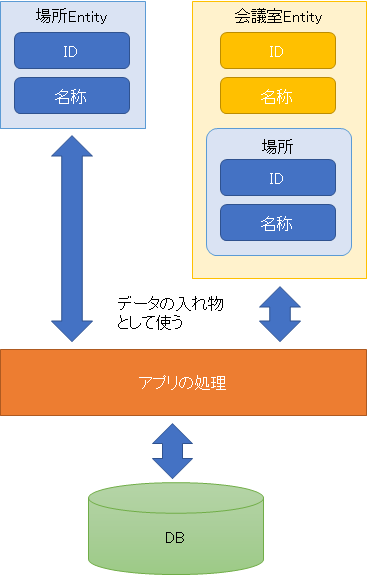
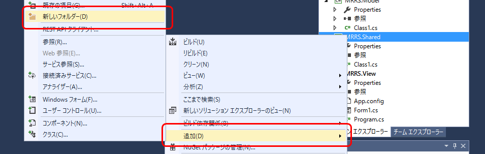
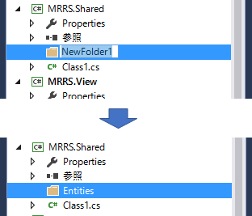
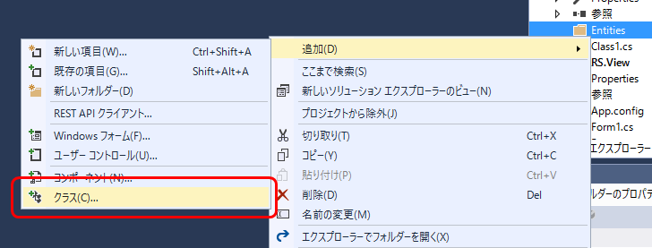
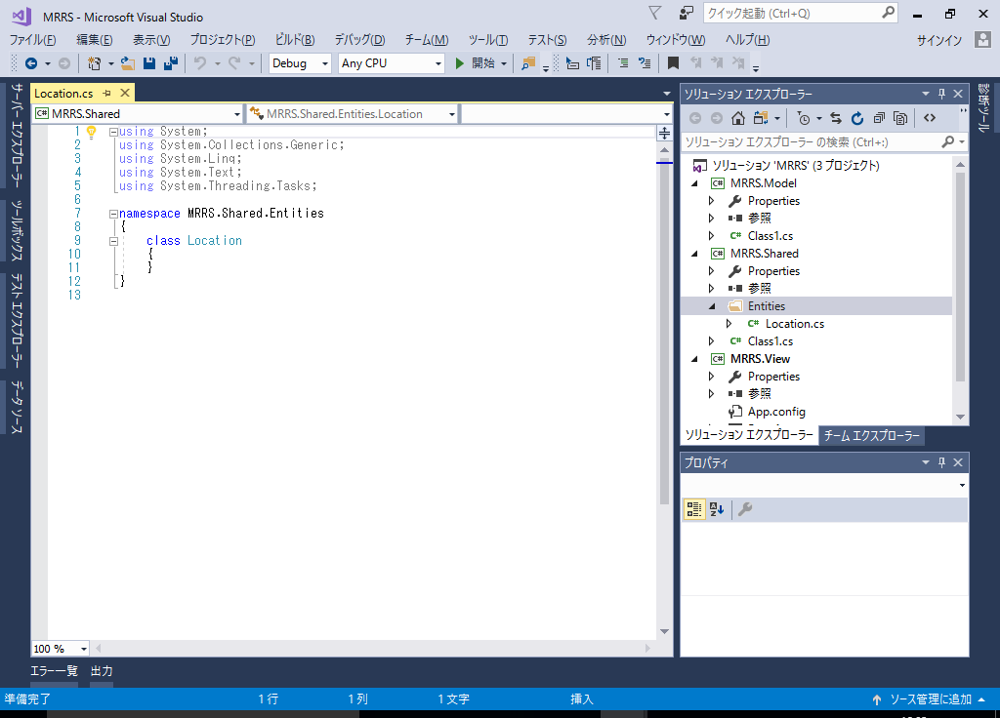
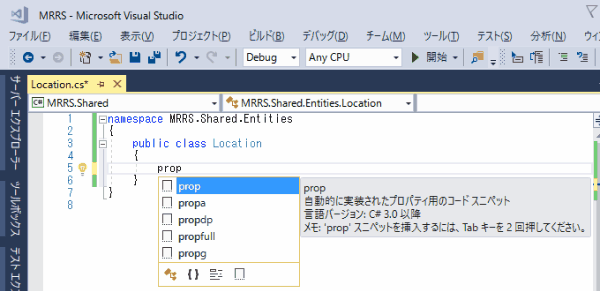
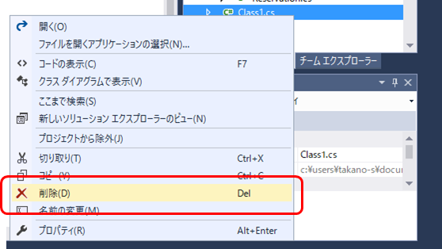
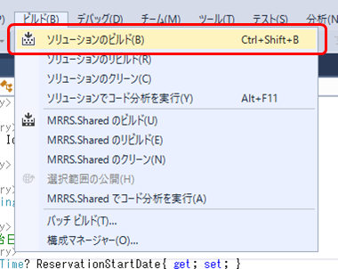

第3章 Entityクラスを作成しよう
=====

[↑目次](../README.md "目次")

[←第2章 ソリューションを作成しよう](01.md)

それではアプリの実装を始めます。アプリを作成するとなると、最初に画面を作りたくなりますが、そこはぐっとこらえてまずは共有プロジェクトにEntityクラスを作成するところから始めましょう。

## 3.1 Entityクラスとは

そもそもアプリは何を行うものでしょうか。突き詰めればユーザーの指示を受けてデータを取り出し、編集して保存することがすべてです。したがって、まずはアプリでデータを取り出したり編集したりするときに、扱いやすい方法を用意する必要があります。

そこで登場するのが「Entity（エンティティ）クラス」です。Entityとは「実体」などを意味する単語で、ここではアプリが扱うデータの一つの単位を表します。今回のアプリでは、場所、会議室、予約というデータを扱いますので、それぞれに対応したEntityクラスを用意してやります。

Entityクラスの特徴としては、データの値だけ持ち処理を持たないこと、データの項目に対応したプロパティを持つこと、他のデータへの参照として内部に他のEnitityクラスのプロパティを持つことの3つです。

このようにすることで、Entityクラスは「データを入れる器」としての責務に専念し、データの取得や編集といった処理を、別のクラスに任せて責務分割を行います。また、他のEntityクラスのプロパティを内部に持っていることで、「O/R マッパー」などのツールでデータを取り出しやすくなるという利点もあります。



## 3.2 場所のEntityクラスを作成しよう

それでは、今回のアプリに必要なEntityクラスを順に作成していきましょう。

まず、他の共有コードから区別して管理できるよう、Entityクラスを格納するためのフォルダーを作成します。［ソリューションエクスプローラー］にて`MRRS.Shared`プロジェクトを右クリックし、コンテキストメニューから［追加］－［新しいフォルダー］をクリックします。



プロジェクトに新しいフォルダーが追加され、"NewFolder1"という名前が既定で設定され、全選択されているので、そのまま"Entities"（Entityの複数形）と入力して、`Enter`キーを押します。



次に場所のEntityクラスを追加するため、［Entities］フォルダーを右クリックし、コンテキストメニューから［追加］－［クラス］をクリックします。



既にテンプレートから［クラス］が選ばれているので、［名前］に場所テーブルの物理名である「LOCATION」をPascal形式にした"Location"を入力し、［OK］ボタンをクリックします。


プロジェクトに［Location.cs］ファイルが追加され、コードエディターで表示されます。



続いて、Locationクラス定義を変更します。まず、アクセス修飾子が何もないため、他のプロジェクトからはこのままでは使えませんので、`public`を追加します。そして、テーブル設計書を元に、場所テーブルの列に対応する2つのプロパティを追加します。

**リスト 3-1** Locationクラス（Location.cs）

```csharp
namespace MRRS.Shared.Entities
{
    /// <summary>
    /// 場所のEntityクラスです。
    /// </summary>
    public class Location
    {
        /// <summary>
        /// ID。
        /// </summary>
        public int? Id { get; set; }

        /// <summary>
        /// 名称。
        /// </summary>
        public string Name { get; set; }
    }
}
```

IDはIdentityの略語であり、DBやIOのような頭字語ではありません。したがって、ID列に対応するIdプロパティの名前は、マイクロソフトの以下のガイドラインに従っています。

- [大文字と小文字の表記規則](https://msdn.microsoft.com/ja-jp/library/ms229043.aspx)

> ### 複合語の大文字と一般的な用語
>
> **X DO NOT** いわゆる閉じた形式の複合語の各単語を大文字に変換しないでください。
>
> Pascal形式 | キャメル形式 | Not
> --- | --- | ---
> Id | id | ID

また、ID列はテーブル上NUMBER型ですが、アプリ内で新規登録時はIDが未定のケースも考えられるため、`int?`のnull許容型としました。

- - -
### コードスニペットの利用
クラスにプロパティを追加する際、`prop`コードスニペットを使うと便利です。
1. プロパティを追加したい箇所で`prop`と入力する。
2. `Tab`キーを2回押す。
3. 基本的な自動実装プロパティのコードが挿入されるので、型を入力して`Tab`キーを押す。
4. プロパティ名を入力して`Enter`キーを押す。


- - -

## 3.3 会議室のEntityクラスを作成しよう

続いて会議室のEntityクラスを作成しましょう。まず、場所と同様にIDと名称を持つ`MeetingRoom`クラスを作成します。

**リスト 3-2** 基本的なMeetingRoomクラス（MeetingRoom.cs）

```csharp
namespace MRRS.Shared.Entities
{
    /// <summary>
    /// 会議室のEntityクラスです。
    /// </summary>
    public class MeetingRoom
    {
        /// <summary>
        /// ID。
        /// </summary>
        public int? Id { get; set; }

        /// <summary>
        /// 名称。
        /// </summary>
        public string Name { get; set; }
    }
}
```

続いて、会議室テーブルにある場所ID列に対応したプロパティを追加します。ただ、アプリの中では場所IDだけを使うケースはあまりなく、場所の名称と一緒に使うことが多いため、Location型のプロパティを追加します。ただ、場所のIDと名称も扱えた方が都合が良いので、取得専用プロパティとして、場所ID、場所名を追加します。このとき、式による定義を活用するとシンプルに表現できます。

**リスト 3-3** 場所を追加したMeetingRoomクラス（MeetingRoom.cs）

```csharp
namespace MRRS.Shared.Entities
{
    /// <summary>
    /// 会議室のEntityクラスです。
    /// </summary>
    public class MeetingRoom
    {
        /// <summary>
        /// ID。
        /// </summary>
        public int? Id { get; set; }

        /// <summary>
        /// 場所。
        /// </summary>
        public Location Location { get; set; }

        /// <summary>
        /// 名称。
        /// </summary>
        public string Name { get; set; }

        /// <summary>
        /// 場所ID。
        /// </summary>
        public int? LocationId => Location?.Id;

        /// <summary>
        /// 場所名称。
        /// </summary>
        public string LocationName => Location?.Name;
    }
}
```

場所のIDや名称を取得する際に注意することがあります。それはLocationプロパティが`null`であるケースです。何も対策を取らないと、LocationIdプロパティにアクセスしたとたんに`NullReferenceException`が発生してしまいます。
本サンプルでは、対策として「null条件演算子」`?.`を用います。null条件演算子を用いることで、`Location`プロパティが`null`の場合は`LocationId`、`LocationName`プロパティが`null`を返すようにできます。

## 3.4 予約のEntityクラスを作成しよう

最後に予約のEntityクラスを作成しましょう。会議室と同様に、予約テーブルに対応する項目と、会議室のID、名称、場所のID、名称を取得する読み取り専用プロパティを追加しましょう。

**リスト 3-4** Reservationクラス（Reservation.cs）

```csharp
using System;

namespace MRRS.Shared.Entities
{
    /// <summary>
    /// 予約のEntityクラスです。
    /// </summary>
    public class Reservation
    {
        /// <summary>
        /// ID。
        /// </summary>
        public int? Id { get; set; }

        /// <summary>
        /// 会議室。
        /// </summary>
        public MeetingRoom MeetingRoom { get; set; }

        /// <summary>
        /// 予約開始日時。
        /// </summary>
        public DateTime? ReservationStartDate{ get; set; }

        /// <summary>
        /// 予約終了日時。
        /// </summary>
        public DateTime? ReservationEndDate { get; set; }

        /// <summary>
        /// 利用者。
        /// </summary>
        public string UserName { get; set; }

        /// <summary>
        /// 場所ID。
        /// </summary>
        public int? LocationId => MeetingRoom?.Location?.Id;

        /// <summary>
        /// 場所名称。
        /// </summary>
        public string LocationName => MeetingRoom?.Location?.Name;

        /// <summary>
        /// 会議室ID。
        /// </summary>
        public int? MeetingRoomId => MeetingRoom?.Id;

        /// <summary>
        /// 会議室名称。
        /// </summary>
        public string MeetingRoomName => MeetingRoom?.Name;
    }
}
```

ポイントは、テーブル上`DATE`型の予約開始日、予約終了日の型を、C#で日時を扱う`DateTime?`null許容型で定義することと、場所の情報を取得する際、null条件演算子を重ねて利用していることです。

## 3.5 不要なクラスを削除しよう

プロジェクト作成時に作られた［Class1.cs］ファイルは、不要なのでここで削除してしまいましょう。［ソリューションエクスプローラー］でファイルを選択し、`Del`キーを押すか右クリックしてコンテキストメニューから［削除］をクリックしてください。



削除の確認ダイアログが表示されるので、［OK］をクリックします。


ここでアプリを一度ビルドしておきましょう。`Ctrl`+`Shift`+`B`キーを押すか、［ビルド］メニューから［ソリューションのビルド］をクリックしてください。



以上でEntityクラスが作成できましたので、次はアプリの処理の実装に入っていきましょう。

[→第4章 Modelクラスを作成しよう](04.md)
