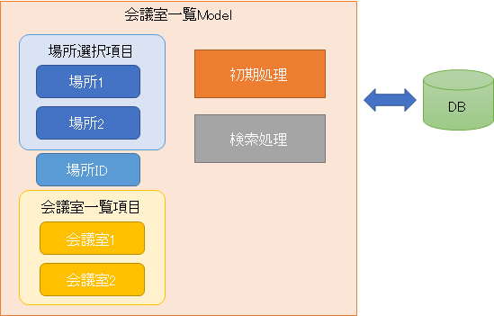
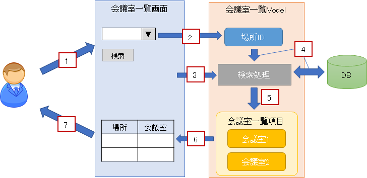
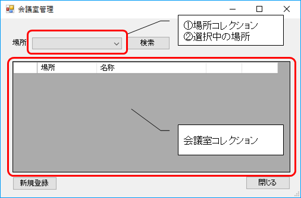
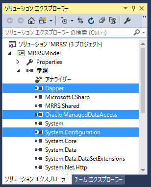

第4章 Modelクラスを作成しよう
=====

[↑目次](../README.md "目次")

[←第3章 Entityクラスを作成しよう](03.md)

データの入れ物となるEntityクラスができたので、次はアプリの処理の実装に入りましょう。まずは処理プロジェクトにModelクラスを作成します。

## 4.1 Modelクラスとは

Entityクラスはデータの入れ物でしたが、アプリの中ではそのデータを必要に応じて取り出し、保持して、ユーザーの入力によって書き換える必要があります。そのような「アプリの状態」を管理するのがModelクラスです。

Modelクラスは状態の保持だけでなく、外部とやり取りしてデータのやり取り等の処理も行います。そのため、Modelクラスは「アプリの本質的な部分」を責務として担うクラスともいえます。



Modelクラスを用いたアプリの動作は次のようになります。



1. ユーザーがUIを通じて画面に入力する
2. 画面がユーザーの入力した内容をModelに反映する
3. 画面がModelの処理を起動する
4. Modelが自らの状態を使ってデータのやり取りなどの処理を行う
5. Modelが処理結果を元に自らの状態を変更する
6. 画面が処理を行った後のModelの状態を取得してUIに反映する
7. ユーザーが処理結果をUIを通じて参照する

これらの内、1,2,3,6,7は画面の責務、4,5はModelの責務となります。そして、4,5を見ると分かるように、Model画面を直接操作することははありません。これは言い換えると、「画面の見せ方」が変わった(テキストボックスからラベルに変更する、など)としても、Modelの変更は必要ないということです。

上記1→7の流れを意識して守るようにすることで、アプリの構造が保守しやすいものにできます。


## 4.2 会議室一覧画面のModelクラスを作成する

Modelクラスの役割が分かったところで、実際にModelクラスを作成していきましょう。Modelクラスはアプリの本質とは言いましたが、管理が難しくなるので、まずは画面と1対1になるModelクラスを作成するやり方を身に付けます。

最初に作成するのは「会議室一覧画面」に対応するModelクラスです。Modelクラスを作成する前に、画面レイアウトを確認しておきましょう。



この画面からModelにどんなプロパティが必要か考えていきます。まず、検索条件の［場所］に注目します。この項目はドロップダウンリストであり、①選択肢となる場所のコレクション、②現在選択中の場所という2つの状態が必要なことがわかります。次にグリッドを見ると、こちらは会議室のコレクションが必要です。

以上を踏まえて会議室一覧画面のModelクラスを作成しましょう。`MRRS.Model`プロジェクトにEntityクラス作成時と同様の手順で、`MeetingRoomListModel`クラスを作成し、次のように入力してください。

**リスト 4-1** 会議室一覧画面Modelクラス（MeetingRoomListModel.cs）

```csharp
using System;
using System.Collections.Generic;
using System.Linq;

using MRRS.Shared.Entities;

namespace MRRS.Model
{
    /// <summary>
    /// 会議室一覧画面のModelクラスです。
    /// </summary>
    public class MeetingRoomListModel
    {
        /// <summary>
        /// 場所コレクション。
        /// </summary>
        public IReadOnlyList<Location> Locations { get; private set; }

        /// <summary>
        /// 場所。
        /// </summary>
        public Location Location { get; set; }

        /// <summary>
        /// 会議室コレクション。
        /// </summary>
        public IReadOnlyList<MeetingRoom> MeetingRooms { get; private set; }
    }
}
```

場所コレクション、会議室コレクションの型は、[`IReadOnlyList<T>`インターフェイス](https://msdn.microsoft.com/ja-jp/library/hh192385.aspx)にしました。この型はその名の通り「読み取り専用のリスト」であり、要素数の取得と配列のようにインデックスを指定して要素を取得することはできますが、要素の追加や削除はできません。

もちろん、これらのプロパティに設定されるオブジェクトは、配列でも`List<T>`クラスのオブジェクトでも構いません。しかし、それは内部の実装の都合でいくらでも変わる恐れがあります。今回のコードのようにModelの外部に見せる型をインターフェイスにしていれば、利用側はそれが配列かどうかは意識せず、インターフェイスが提供している操作(`IReadOnlyList<T>`なら`Count`プロパティと`Items[int]`インデクサー)を行えることが保証されます。

なお、`Locations`プロパティ、`MeetingRooms`プロパティとも、Modelの内部からしか代入を行わないので、`set`句は`private`にしています。

- - -

### [コラム] コレクションの仲間

C#で使えるコレクションの型にはいくつか種類があります。

- 配列  
  言語に組み込まれたコレクションで、要素数があらかじめ決まっていて、各要素にインデクサを使ってアクセスできます。
- リスト  
  [`IList<T>`インターフェイス](https://msdn.microsoft.com/ja-jp/library/5y536ey6.aspx)を実装したコレクションで、要素の追加、変更、削除もできるコレクションです。内部実装のやり方によって、いくつか種類があります。
    - [`List<T>`](https://msdn.microsoft.com/ja-jp/library/6sh2ey19.aspx) : 最も基本的な要素を配列で管理するリスト。
    - [`LinkedList<T>`](https://msdn.microsoft.com/ja-jp/library/he2s3bh7.aspx) : 要素をオブジェクト間の参照でつないだリスト。
    - [`SortedList<TKey, TValue>`](https://msdn.microsoft.com/ja-jp/library/ms132319.aspx) : 要素の並べ替えを自動で行うリスト。
- ディクショナリ  
  [`IDictionary<TKey, TValue>`インターフェイス](https://msdn.microsoft.com/ja-jp/library/s4ys34ea.aspx)を実装したコレクションで、キーを指定して値を取り出すことができます。内部実装のやり方によって、いくつか種類があります。
    - [`Dictionary<TKey, TValue>`](https://msdn.microsoft.com/ja-jp/library/xfhwa508.aspx) : 最も基本的なディクショナリ。
    - [`SortedDictionary<TKey, TValue>`](https://msdn.microsoft.com/ja-jp/library/f7fta44c.aspx) : 要素をキー順に取り出すことのできるディクショナリ。
- キュー/スタック
    追加した要素を追加した順/追加した逆順で取り出すことのできるコレクションです。
    - [`Queue<T>`](https://msdn.microsoft.com/ja-jp/library/7977ey2c.aspx) : 要素を追加した順に取り出せるコレクション。
    - [`Stack<T>`](https://msdn.microsoft.com/ja-jp/library/3278tedw.aspx) : 要素を追加した逆順に取り出せるコレクション。


- - -

## 4.3 会議室一覧画面Modelに初期処理を追加しよう

会議室一覧画面Modelに状態を管理するための各プロパティを定義したので、次は実際の処理を作成していきます。まずは画面の起動処理で使用する初期処理から作成します。

詳細設計書から会議室一覧画面の起動処理を抜粋します。

> ### 1) ウィンドウの表示
> 
> ウィンドウをメニュー画面の中央に表示する。
> 
> ### 2) 場所の選択項目の設定
> 
> 検索条件の場所ドロップダウンリストの選択項目を場所テーブルより設定する。
> 
>   ①場所データ取得
>   場所テーブルより以下のように場所データを取得する。
> 
>     ［抽出条件］
>
>       全データ
> 
>     ［並び順］
> 
>       名称（昇順）
> 
>   ②場所選択項目設定
> 
>    i.  場所ドロップダウンリストの先頭に未選択を表す空項目を追加する。
> 
>    ii. ①で取得した場所データをすべて追加する。
> 
> ### 3) 初期フォーカスの設定
> 
>   場所にカーソルを設定する。

この中でModelクラスの責務とすべきなのは、「2) 場所の選択項目の設定」の中の①および②の「ドロップダウンリスト」に関係するところ以外です。つまり、初期処理が終わった段階では、ModelのLocationsプロパティに「先頭に空の場所データ、以後に①で取得した場所データが追加されたコレクション」が設定されている状態になればよいでしょう。

それでは、初期化処理を実装する準備を行いましょう。参考資料[DBプログラミング入門 by ODP.NET](https://github.com/masaru-b-cl/introduction-to-db-programming-by-odp-dot-net)を参考に、`MRRS.Model`プロジェクトに`System.Configuration`アセンブリへの参照を追加し、NuGetパッケージ`Dapper`と`Oracle.ManagedDataAccess`をインストールしてください。



準備が整ったら、初期処理を行う`Initialize`メソッドを作成します。次のコードを見てください。

**リスト 4-2** 会議室一覧画面Modelクラスの初期処理（MeetingRoomListModel.cs）

```csharp
using System.Collections.Generic;
using System.Configuration;
using System.Data;
using System.Data.Common;
using System.Linq;
using Dapper;

using MRRS.Shared.Entities;

namespace MRRS.Model
{
    /// <summary>
    /// 会議室一覧画面のModelクラスです。
    /// </summary>
    public class MeetingRoomListModel
    {
        ...(省略)...

        /// <summary>
        /// 画面起動時の初期処理を行います。
        /// </summary>
        public void Initialize()
        {
            using (var conn = CreateConnection())
            {
                // 空の場所作成
                var emptyLocation = new Location();
                // 場所を名前順に取得
                var locations = conn.Query<Location>(@"
                    select
                     ID
                    ,NAME
                    from
                     LOCATION
                    order by
                     NAME
                    ");

                // 空の場所と取得した場所を連結する
                Locations = new[] { emptyLocation }
                    .Concat(locations)
                    .ToArray();

                // 初期値設定
                Location = emptyLocation;
            }
        }

        /// <summary>
        /// DB接続を作成します。
        /// </summary>
        /// <returns>作成したDB接続。</returns>
        public static IDbConnection CreateConnection()
        {
            var connectionStringSettings = ConfigurationManager.ConnectionStrings["MRRS"];
            var factory = DbProviderFactories.GetFactory(connectionStringSettings.ProviderName);
            var conn = factory.CreateConnection();
            conn.ConnectionString = connectionStringSettings.ConnectionString;
            return conn;
        }
    }
}
```

`Initialize`メソッドでは、空の場所を表す`Location`型の`emptyLocation`変数と、DBよりDapperを使い取得した`Location`型のコレクションを連結して、`Locations`プロパティに設定しています。この時、最後に`ToArray`メソッドを呼び出し、[`Concat`メソッド](https://msdn.microsoft.com/ja-jp/library/bb302894.aspx)の戻り値である`IEnumerable<Location>`型のオブジェクトを配列に変換しています。配列は`IReadOnlyList<T>`インターフェイスを実装しているため、`Locations`プロパティに代入することができます。

また、画面の検索条件の場所についても、初期選択値を設定するため、`Locations`プロパティに設定したコレクションの先頭と同じ、空の`Location`クラスのインスタンスを設定します。

なお、DB接続処理は`CreateConnection`メソッドに切り離していて、今は暫定で"MRRS"という名前でDB接続情報を取得するようにしています。この処理は他のModelクラスでも使いますので、後で専用クラスに切り出します。


## 4.4 DB接続作成処理を切り出そう

DB接続作成処理が今は`MeetingRoomListModel`クラスの中に定義されていますが、他のModelクラスでも使うことが明白なので、この処理を別のクラスに切り出しましょう。

まず、`MRRS.Model`プロジェクトに新たなクラス`DbProvider`を追加します。そして、`DbProvider`クラスにstaticキーワードを付け、`MeetingRoomListModel`クラスの`CreateConnection`メソッドをコピーします。なお、`DbProvider`クラスは他のプロジェクトから使うことはないので、そのことを`internal`キーワードで明示しておきましょう。

**リスト 4-3** DB接続作成処理クラス（DbProvider.csより）

```csharp
using System.Configuration;
using System.Data;
using System.Data.Common;

namespace MRRS.Model
{
    /// <summary>
    /// DBに関する機能を提供します。
    /// </summary>
    internal static class DbProvider
    {
        /// <summary>
        /// DB接続を作成します。
        /// </summary>
        /// <returns>作成したDB接続。</returns>
        public static IDbConnection CreateConnection()
        {
            var connectionStringSettings = ConfigurationManager.ConnectionStrings["MRRS"];
            var factory = DbProviderFactories.GetFactory(connectionStringSettings.ProviderName);
            var conn = factory.CreateConnection();
            conn.ConnectionString = connectionStringSettings.ConnectionString;
            return conn;
        }
    }
}
```

その後、`MeetingRoomListModel`クラスの`CreateConnection`メソッドを呼び出している箇所を`DbProvider.CreateConnection`メソッドを呼び出すよう変更し、`CreateConnection`メソッドを削除します。

**リスト 4-4** DB接続作成処理を切り出したModelクラス（MeetingRoomListModel.csより）

```csharp
using System.Collections.Generic;
using System.Linq;

using Dapper;

using MRRS.Shared.Entities;

namespace MRRS.Model
{
    /// <summary>
    /// 会議室一覧画面のModelクラスです。
    /// </summary>
    public class MeetingRoomListModel
    {
        ...(省略)...

        /// <summary>
        /// 画面起動時の初期処理を行います。
        /// </summary>
        public void Initialize()
        {
            using (var conn = DbProvider.CreateConnection())
            {
                ...(省略)...
            }
        }
    }
}
```

会議室一覧画面のModelクラスについては、これで完成です。次は画面を作成し、動作を確認してみましょう。

[→第5章 画面を作成しよう](05.md)
