第5章 画面を作成しよう
=====

[↑目次](../README.md "目次")

[←第4章 Modelクラスを作成しよう](04.md)

いよいよ画面の作成に入ります。メニューと会議室一覧画面を作成していきましょう。

## 5.1 メニューを作成しよう

最初に会議室予約システムのアプリを起動して最初に表示されるメニューを作成しましょう。メニューは各機能を起動するボタンとアプリを終了するボタンがあるだけの簡単な画面です。

まず、画面プロジェクトを作成した際に自動で作成された、［Form1.cs］ファイルの名前を変更しましょう。［ソリューションエクスプローラー］にて［Form1.cs］をクリックして選択した後、`F2`キーを押してください。

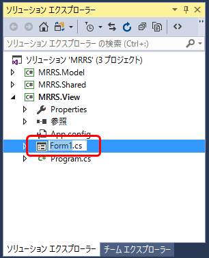

名前を入力できる状態になるので、"MenuForm"と入力して`Enter`キーを押すと、名前が変更されます。その後、ファイル名に合わせてフォームクラス名も変更してよいか確認するダイアログが表示されるので、［はい］をクリックします。

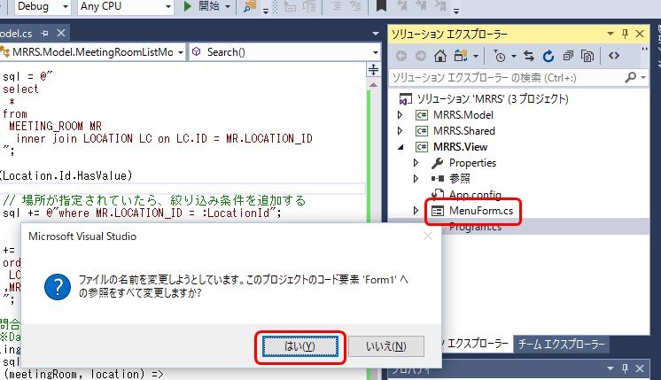

［ソリューションエクスプローラー］にて［MenuForm.cs］ファイルを選択し、［コードの表示］ボタンをクリックして、フォームのコードを確認すると、クラス名が`Form1`ではなく`MenuForm`に変更されています。

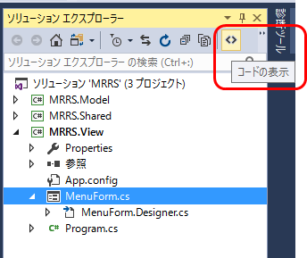

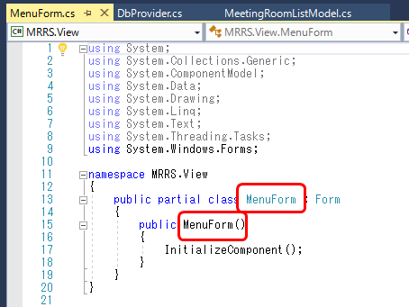

次にメニュー画面のレイアウトを整えていきましょう。まず、機能仕様書を元に、［場所管理］、［会議室管理］、［予約管理］、［終了］の各ボタンを配置し、次のようにコントロール名をつけましょう。

ボタン | コントロール名
--- | ---
場所管理 | LocationButton
会議室管理 | MeetingRoomButton
予約管理 | ReservationButton
終了 | CloseButton


今度はフォームを設定します。

- タイトルは「会議室予約システム」
- サイズを仕様書のように変更
- フォームサイズ変更をできなくする
- 最大化ボタンを無効にする

という要件を満たすため、次のようにフォームのプロパティを設定します。

プロパティ名 | 値
--- | ---
FormBorderStyle | FixedSingle
MaximizeBox | False
Size | 290, 260
Text | 会議室予約システム

その後、ボタンのサイズを「100, 40」に変更して位置を整え、次のようにレイアウトを調整します。

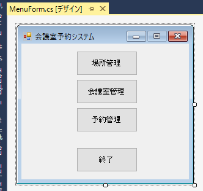

## 5.2 会議室一覧画面を作成しよう

続いて、会議室一覧画面を作成しましょう。

### フォームの追加

［ソリューションエクスプローラー］にて`MRRS.View`プロジェクトを右クリックし、コンテキストメニューから［追加］－［Windowsフォーム］をクリックします。


［新しい項目の追加］ダイアログにて、テンプレートで［Windowsフォーム］が選択されていることを確認し、［名前］欄に"MeetingRoomListForm"と入力して［追加］ボタンをクリックします。

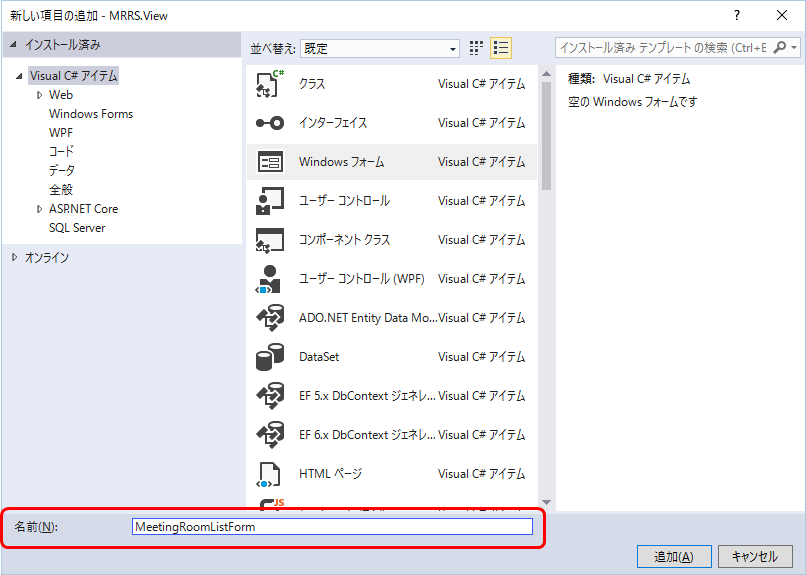

### 場所の追加

フォームに場所のラベルとコンボボックスコントロールを追加し、それぞれ次のようにプロパティを設定します（コントロールの位置は適当な位置でよい）。

#### ラベル

プロパティ | 値
--- | ---
(Name) | locationLabel
Text | 場所

#### コンボボックス 

プロパティ | 値
--- | ---
(Name) | locationComboBox
DropDownStyle | DropDownList

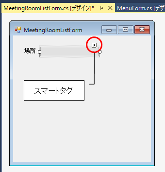

続いて、場所コンボボックスの選択項目をデータバインドするため、コントロールを選択して右上に出る［スマートタグ］をクリックします。すると［ComboBoxタスク］ウィンドウが表示されるので、［データバインド項目を使用する］にチェックを入れ、［データソース］をクリックして開き、［プロジェクトデータソースの追加］をクリックします。

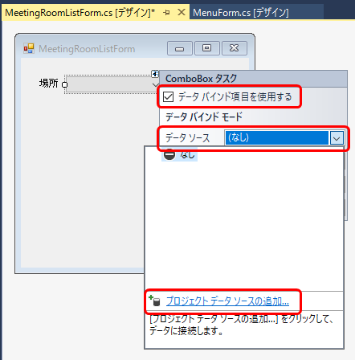

［データソース構成ウィザード］ダイアログの［データソースの種類の選択］画面が表示されたら、［アプリケーションのデータの取得元を指定してください］で［オブジェクト］を選び、［次へ］ボタンをクリックします。

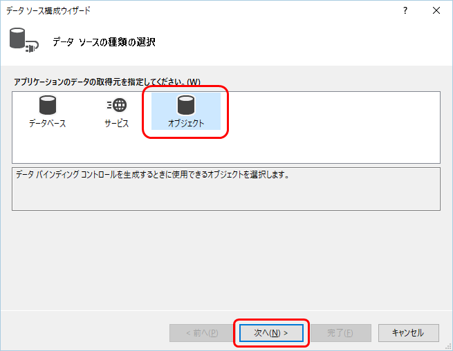

［データオブジェクトの選択］画面が表示されたら、［どのオブジェクトにバインドしますか？］欄で`MRRS.Shared`プロジェクトに作成した`MRRS.Shared.Entities.Location`クラスにチェックを入れ、［完了］ボタンをクリックします。

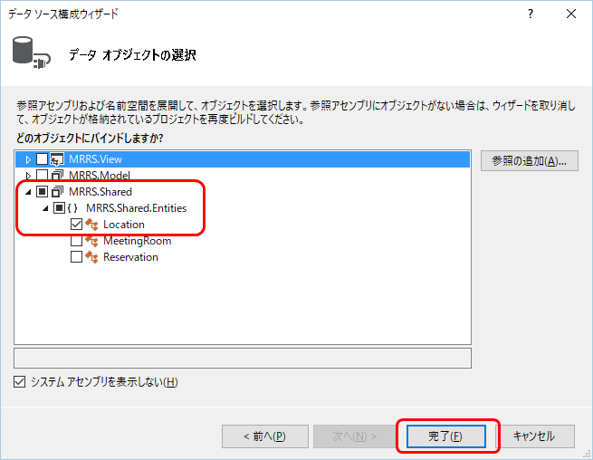

フォームデザイナーに戻ると、下部にBindingSourceコンポーネント［locationBindingSource］が追加されています（この部分を「コンポーネントトレイ」と呼びます）。そして、［ComboBoxタスク］の［データソース］で［locationBindingSource］が選択された状態になるので、そのまま［表示メンバー］に［Name］、値メンバーに［Id］を指定します（`Location`クラスのプロパティが選択できます）。これで、ComboBoxには`Location`クラスの`Name`プロパティの値が表示され、選択値は`Id`プロパティの値が取得できるようになります。


### 会議室一覧の追加

今度は会議室一覧を表示するDataGridViewコントロールを追加します。すると、、次のようにスマートタグが展開され［DataGridViewタスク］が表示されます。この画面のグリッドは参照専用なので、［追加を有効にする］、［編集を有効にする］、［削除を有効にする］のチェックを外します。

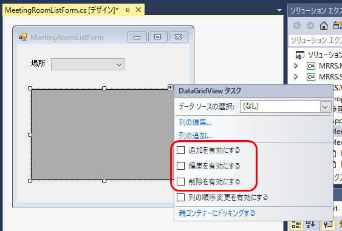

次に、場所ComboBoxと同様に、こちらも会議室データに対するデータバインド設定を行います。［データソースの選択］をクリックし、再び［プロジェクトデータソースの追加］を選びます。

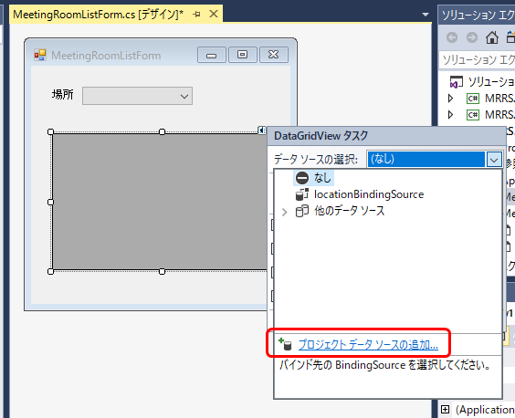

今度は`MRRS.Shared.Entities.MeetingRoom`クラスを選びます。

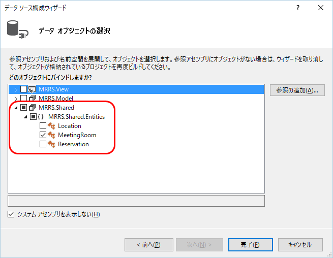

すると、［コンポーネントトレイ］に［meetingRoomBindingSource］が追加され、［DataGridViewタスク］の［データソースの選択］でも選ばれた状態になります。また、DataGridViewコントロールに自動的に`MeetingRoom`クラスのプロパティに対応した列が追加されます。

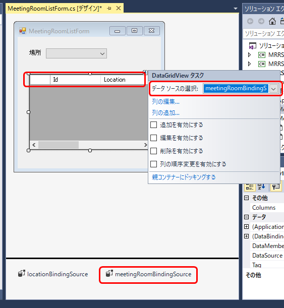

このままDataGridViewの列を編集しましょう。［DataGridViewタスク］の［列の編集］をクリックします。

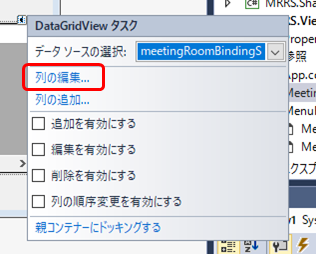

既定で追加された列の内、［Id］、［Location］、［LocationId］を削除します。次に［LocationName］を［Name］列の前に移動し、それぞれの［HeaderText］プロパティを次のように変更します。

列 | HeaderText
--- | ---
LocationName | 場所
Name | 名称

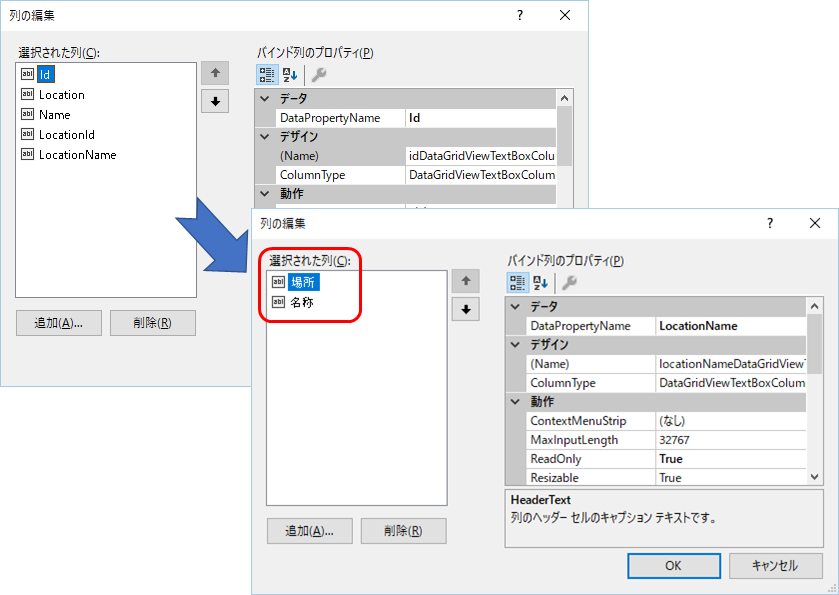

今度は［変更］、［削除］ボタン列を追加します。まず［変更］列を追加するため、［追加］ボタンをクリックして［列の追加］ダイアログを表示します。そして［非バインド列」を選択し、［名前］に"modifyDataGridViewButtonColumn"、型を［DataGridViewButtonColumn］、［ヘッダーテキスト］を空にして［追加］ボタンをクリックします。同様に［削除］列も［名前］を"deleteDataGridViewButtonColumn"にして登録します。

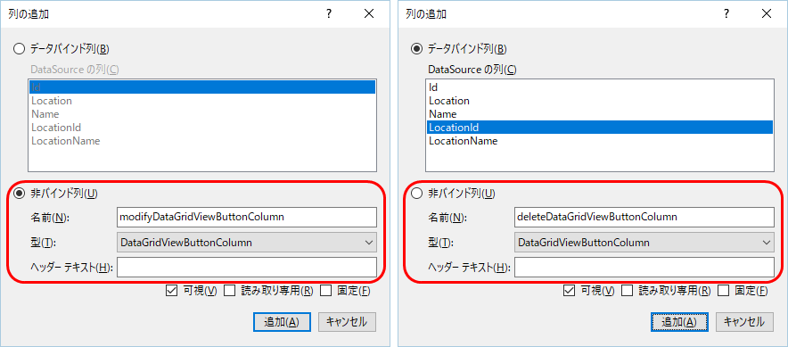

追加したボタン列は、ボタンのキャプションを表示するため、［UseColumnTextForButtonValue］プロパティを［True］にし、［Text］プロパティにそれぞれ、"変更"、"削除"を入力します。


最後に各列の幅を調整するため、Widthプロパティを次のように設定します。

列 | Width
--- | ---
場所 | 100
名称 | 180
変更ボタン | 60
削除ボタン | 60

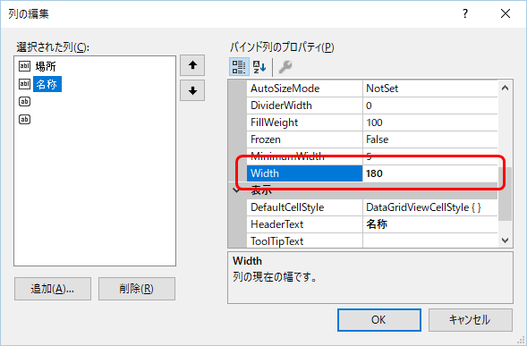

設定を終えたら［OK］ボタンをクリックしてください。フォームデザイナー上のDataGridViewに設定内容が反映されます。

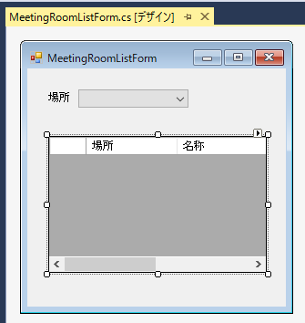

最後にDataGridViewのプロパティを次のように設定します。

プロパティ名 | 値
--- | ---
(Name) | meetingRoomDataGridView
Anchor | Top, Left, Right, Bottom
Location | 20, 70

［Anchor］（anchor：錨）プロパティは、［プロパティ］ウィンドウでクリックして展開して、上下左右で固定したいところをクリックして選択できます。

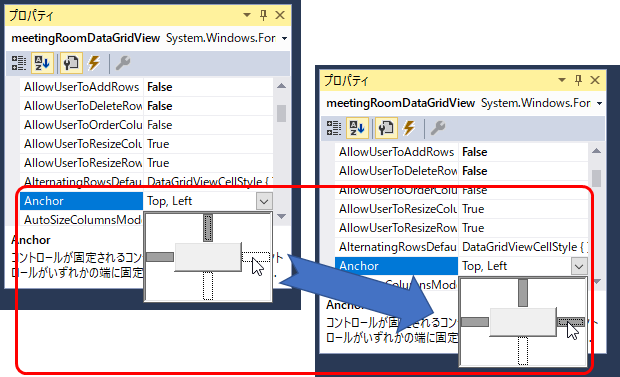

最後に、グリッドの列が全部表示される程度までフォームを大きくします。また、ウィンドウのタイトルも設定しましょう。次のようにフォームのプロパティを設定してください。

プロパティ名 | 値
--- | ---
Size | 520, 300
Text | 会議室管理

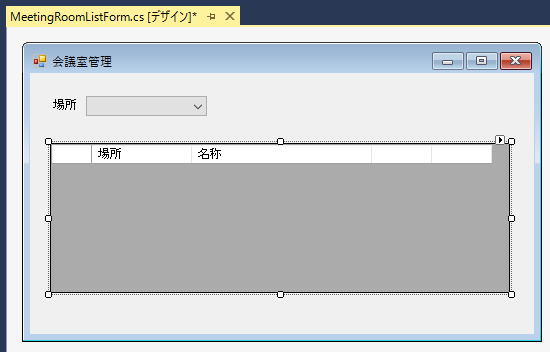

### ボタンの追加

今度はフォームにボタンを追加しましょう。［検索］、［新規登録］、［閉じる］の各ボタンを追加し、次のようにプロパティを設定します。

#### 検索ボタン

プロパティ名 | 値
--- | ---
(Name) | searchButton
Text | 検索

#### 新規登録ボタン

プロパティ名 | 値
--- | ---
(Name) | addNewButton
Anchor | Bottom, Left
Text | 新規登録

#### 閉じるボタン

プロパティ名 | 値
--- | ---
(Name) | closeButton
Anchor | Bottom, Right
Text | 閉じる

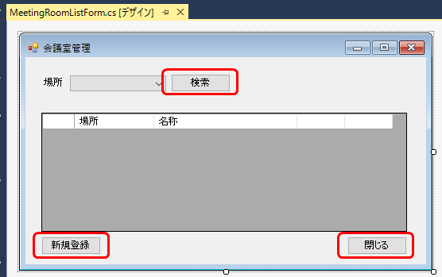

### タブ順の設定

画面作成の最後に、画面の項目のタブ順（`Tab`キーを押したときにカーソルが移動する順番）を設定します。

［表示］メニューの［タブオーダー］を選択します。

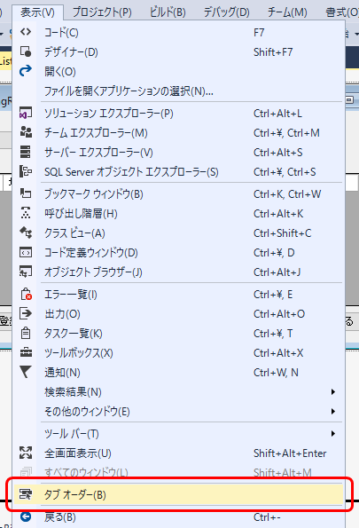

すると、各項目の現在の［TabIndex］（タブインデックス）プロパティの値が表示されます。タブ順を設定するには、画面の項目を順番にクリックします。今回は［場所］コンボボックスから始まり、［検索］ボタン→、［会議櫃一覧］グリッド、［新規登録］ボタン、［閉じる］ボタンの順にクリックし、最後に`ESC`キーを押してタブ順の設定を終わります。

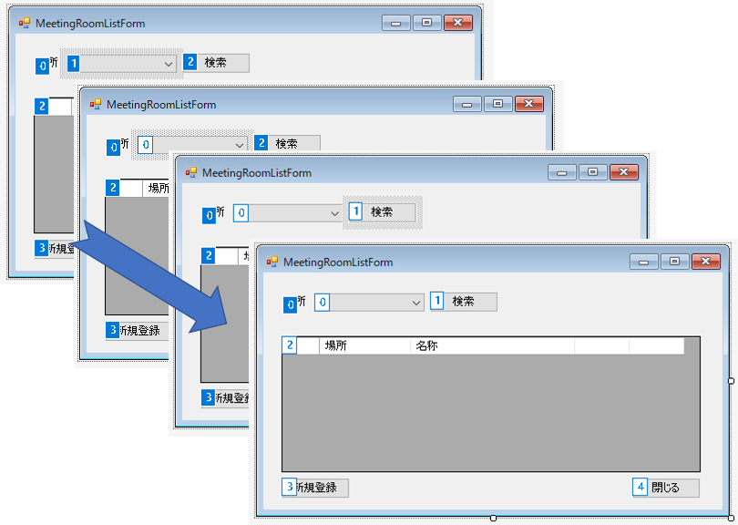

## 5.3 メニューから呼び出そう

会議室一覧画面ができたので、メニューから呼び出してみましょう。［ソリューションエクスプローラー］にて［MenuForm.cs］をダブルクリックして、`MenuForm`のフォームデザイナーを開きます。

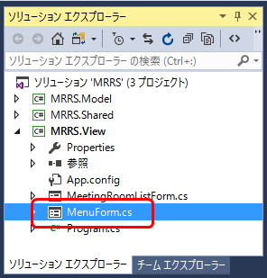

［会議室管理］ボタンの`Click`イベントハンドラーを作成するため、フォームデザイナー上で［会議室管理］ボタンをダブルクリックします。

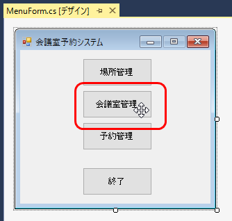

作成されたイベントハンドラーに、会議室一覧画面を表示するコードを記入します。

**リスト 5-1** 会議室一覧画面表示処理（MenuForm.csより）

```c#
private void meetingRoomButton_Click(object sender, EventArgs e)
{
    using (var form = new MeetingRoomListForm())
    {
        form.ShowDialog();
    }
}
```

ここでアプリを実行してここまでの画面が正しく作れたか確認しましょう。`F5`キーを押してデバッグ実行します。すると、メニュー画面が表示されます。

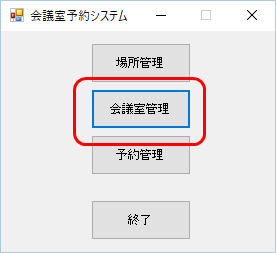

ここで［会議室管理］ボタンをクリックします。すると、会議室一覧画面が表示されます。


ようやく開発対象機能の画面を表示することができました。次は画面からModelの処理を呼び出してみましょう。

[→第6章 Modelクラスをの処理を画面から呼び出そう](06.md)
