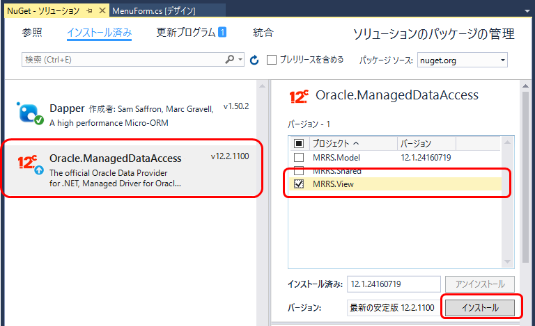
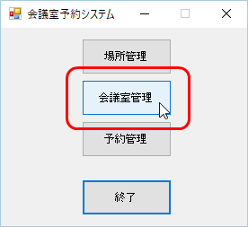
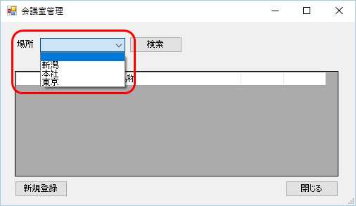

第6章 Modelクラスをの処理を画面から呼び出そう
=====

[↑目次](../README.md "目次")

[←第5章 画面を作成しよう](05.md)

画面が表示されるようになったので、いよいよ画面とModelをつないで処理しましょう。

## 6.1 DBアクセスの準備をしよう

画面からModelの処理を呼び出すコードを書く前に、DBアクセスをできるように準備しておきましょう。

まず、ODP.NETを`MRRS.View`プロジェクトにもNuGetパッケージ`Oracle.ManagedDataAccess`をインストールします。［ソリューションのパッケージの管理］ウィンドウの［インストール済み］タブを表示し、［Oracle.ManagedDataAccess］を選択したら、［MRRS.View］プロジェクトにチェックを入れ、［インストール］ボタンをクリックします。



アプリケーション構成ファイル［App.config］にODP.NET用の設定が追加されるので、参考資料[DBプログラミング入門 by ODP.NET](https://github.com/masaru-b-cl/introduction-to-db-programming-by-odp-dot-net)を参考に、<configuration>要素の`<oracle.manageddataaccess.client>`－`<version>`－`<dataSources>`－`<dataSource>`要素と、`<connectionStrings>`要素を次のように記載します。

**リスト 6-1** DB接続構成設定（App.configより）

```xml
<?xml version="1.0" encoding="utf-8"?>
<configuration>

    ...(省略)...

    <oracle.manageddataaccess.client>
        <version number="*">
            <dataSources>
                <dataSource alias="ORCL"
                    descriptor="(DESCRIPTION=(ADDRESS=(PROTOCOL=tcp)(HOST=hostname)(PORT=1521))(CONNECT_DATA=(SERVICE_NAME=ORCL))) "/>
            </dataSources>
        </version>
    </oracle.manageddataaccess.client>
    <connectionStrings>
        <add name="MRRS"
            providerName="Oracle.ManagedDataAccess.Client"
            connectionString="Data Source=ORCL;User Id=MRRS_DEV;Password=MRRS;" />
    </connectionStrings>
</configuration>
```

場所管理画面はまだ作成していないので、ひとまず以下のDMLを実行し、テスト用の場所を登録しておきます。

```sql
INSERT INTO LOCATION ( ID, NAME ) VALUES ( 1, '本社')
/
INSERT INTO LOCATION ( ID, NAME ) VALUES ( 2, '新潟')
/
INSERT INTO LOCATION ( ID, NAME ) VALUES ( 3, '東京')
/
```

## 6.2 会議室一覧画面の初期処理を行おう

準備ができたので、コードに入っていきましょう。まず、画面でModelクラスのインスタンスを保持できるよう、フィールドを追加します。［MeetingRoomListForm.cs］のコードを表示し、`MeetingRoomListModel`型の`private`フィールドを追加します。また、線源と同時にインスタンスを作成して代入しておきます。

**リスト 6-2** 画面にModel型フィールドを追加（MeetingRoomListForm.csより）

```c#
using System;
using System.Windows.Forms;

using MRRS.Model;

namespace MRRS.View
{
    public partial class MeetingRoomListForm : Form
    {
        // ↓追加コード
        private MeetingRoomListModel model = new MeetingRoomListModel();

        public MeetingRoomListForm()
        {
            InitializeComponent();
        }
    }
}
```

次に、初期処理を行うため、フォームのLoadイベントハンドラーを作成します。

**リスト 6-3** 初期処理（MeetingRoomListForm.csより）

```c#
private void MeetingRoomListForm_Load(object sender, EventArgs e)
{
    // 1) 初期処理
    model.Initialize();

    // 2) 画面に反映
    locationBindingSource.DataSource = model.Locations;

    // 3) 初期フォーカス設定
    ActiveControl = locationComboBox;
}
```

### 1) 初期処理

まず、Modelの初期処理を行う`Initialize`メソッドを呼び出します。

### 2) 画面に反映

今度はModelの状態を画面に反映させます。

場所の選択項目は`BindingSource`コンポーネントを用いたデータバインドを行うため、`DataSource`プロパティにModelの`Locations`プロパティを代入します。初期の選択項目は既定で先頭項目になるため、ここでは設定しません。

### 3) 初期フォーカス設定

最後に初期フォーカスを設定します。フォームの`ActiveControl`プロパティに、初期フォーカスを設定したいコントロール`locationComboBox`を代入します。


## 6.3 動作を確認しよう

それでは、いよいよ画面、Model、Entityを組み合わせた動作を確認します。`F5`キーを押してでバッグ実行して、［会議室管理］ボタンをクリックします。



会議室一覧画面が表示されます。


初期フォーカスが場所ドロップダウンリストに設定されていることと、選択項目がDBから取得、設定されているか確認するため、`Alt`+`↓`キーを押してみましょう。6.1で登録したテストデータが表示されていればOKです。




これまでで画面、Model、Entityの連携方法の基本を学びました。次の章からは、アプリの機能ごとに、必要な実装をそれぞれに行っていきましょう。

[→第7章 会議室を登録しよう](07.md)
