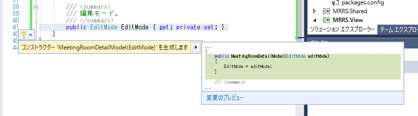
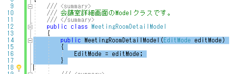
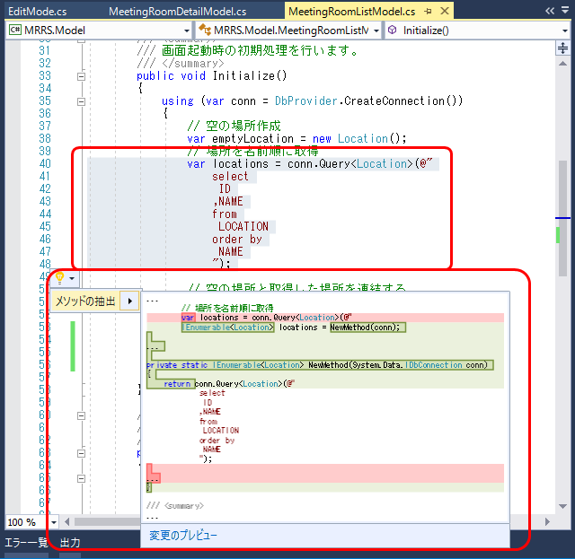
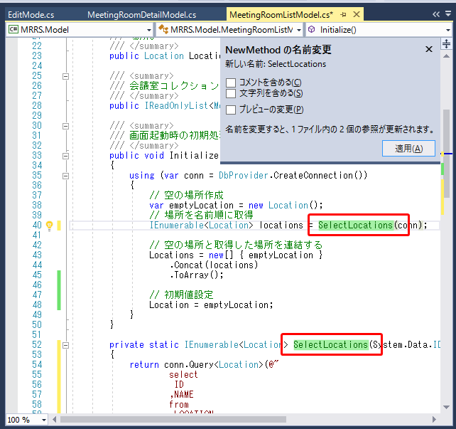
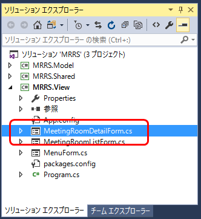
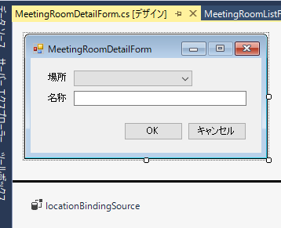
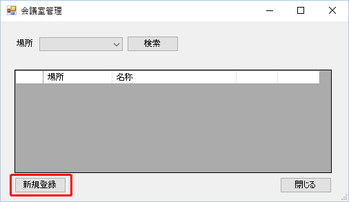
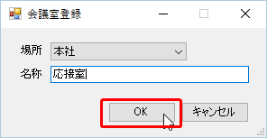
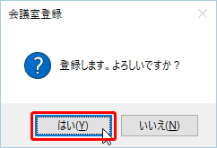
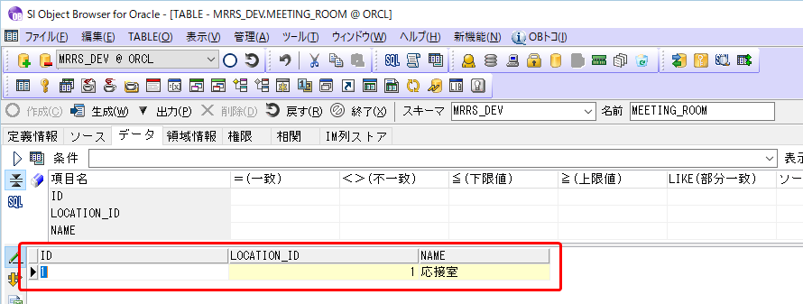

第7章 会議室を登録しよう
=====

[↑目次](../README.md "目次")

[←第6章 Modelクラスをの処理を画面から呼び出そう](06.md)

会議室一覧画面が表示されるようになったので、次は会議室を登録していきましょう。

## 7.1 Modelを作成しよう

最初に、会議室一覧画面と同様に会議室詳細画面用のModelを作成していきます。

### プロパティ定義

機能仕様書の画面イメージから読み取れるModelの状態として、わかりやすいものは「場所」と「名称」の2つです。まずこの2つを持つ`MeetingRoomDetailModel`クラスを作成します。

**リスト 7-1** 会議室詳細画面Modelクラス（MeetingRoomDetailModel.cs）

```csharp
using System;
using System.Collections.Generic;
using System.Linq;

using MRRS.Shared.Entities;

namespace MRRS.Model
{
    /// <summary>
    /// 会議室詳細画面のModelクラスです。
    /// </summary>
    public class MeetingRoomDetailModel
    {
        /// <summary>
        /// 場所コレクション。
        /// </summary>
        public IReadOnlyList<Location> Locations { get; private set; }

        /// <summary>
        /// 場所。
        /// </summary>
        public Location Location {
            get
            {
                return MeetingRoom.Location;
            }
            set
            {
                MeetingRoom.Location = value;
            }
        }

        /// <summary>
        /// 会議室。
        /// </summary>
        public MeetingRoom MeetingRoom { get; private set; }
    }
}
```

場所については`MeetingRoom`クラスにプロパティとして定義されているので、そちら対する取得、設定処理として定義します。また、場所コレクション、会議室は画面から変更することはないので、`set`は`private`にしています。

この他に、画面の編集モードが登録、変更、削除とあるので、こちらも状態として管理したほうが良いでしょう。編集モードは3つの値しかとりませんので、数値や文字列ではなく列挙型として定義します。`MRRS.Model`プロジェクト内にファイルを追加し、次の`EditMode`列挙型を定義します。

**リスト 7-2** 編集モード列挙型（EditMode.cs）

```csharp
namespace MRRS.Model
{
    /// <summary>
    /// 編集モードです。
    /// </summary>
    public enum EditMode
    {
        /// <summary>
        /// 新規登録。
        /// </summary>
        AddNew,

        /// <summary>
        /// 変更
        /// </summary>
        Modify,

        /// <summary>
        /// 削除
        /// </summary>
        Delete
    }
}
```

そして、`MeetingRoomDetailModel`クラスに編集モードを保持するためのプロパティを追加します。

**リスト 7-3** 編集モードを追加（MeetingRoomDetailModel.cs）

```csharp
...(省略)...

namespace MRRS.Model
{
    /// <summary>
    /// 会議室詳細画面のModelクラスです。
    /// </summary>
    public class MeetingRoomDetailModel
    {
        ...(省略)...

        /// <summary>
        /// 編集モード。
        /// </summary>
        public EditMode EditMode { get; private set; }
    }
}
```

また、編集モードは画面側から指定できるよう、コンストラクターで設定するようにします。コードエディターで`EditMode`プロパティの左端をクリックして行選択した後、`Ctrl`+`.`キーを押すか電球アイコンをクリックすると、`EditMode`型を引数に持つコンストラクターを生成できます。



↓




### 初期処理作成

次に、会議室詳細画面の初期処理を作成します。会議室詳細画面の初期処理は、以下の通りです。

1. 場所ドロップダウンリストの選択項目設定
2. 編集対象データを画面に設定
3. 初期フォーカス設定

このうち、新規登録画面で必要なのは1と3です。順に実装しましょう。

まず、1の場所ドロップダウンリストの選択項目設定からです。この処理で行う場所データ取得は、会議室一覧画面のModelと全く同じ処理になるので、共通化しましょう。

`MeetingRoomListModel`クラスをコードエディターで表示し、`Initialize`メソッド内の場所を取得している箇所を選択します。そして、電球マークをクリックして［メソッドの抽出］を選択します。



そのままメソッド名として"SelectLocations"と入力して`Enter`キーを押し、メソッドの抽出を完了します。



今度はこの場所取得を行う`SelectLocations`メソッドを専用のクラスに切り出します。`SelectLocations`メソッドは`static`クラスなので、簡単に他のクラスに追い出すことができます。さらに、他のDapperを使った`Query`メソッド呼び出し箇所と同じように、引数である`IDbConnection`型の拡張メソッドとして定義しましょう。

`MRRS.Model`クラスに`ConnectionExtensions`クラスを新たに追加し、`SelectLocations`メソッドをコピーした後、クラス宣言に`static`キーワード、`conn`引数に`this`キーワードを追加します。

**リスト 7-4** IDbConnection拡張メソッド用クラス（ConnectionExtensions.cs）

```csharp
using System.Collections.Generic;
using System.Data;

using Dapper;

using MRRS.Shared.Entities;

namespace MRRS.Model
{
    internal static class ConnectionExtensions
    {
        /// <summary>
        /// 場所データを名称順に取得します。
        /// </summary>
        public static IEnumerable<Location> SelectLocations(this IDbConnection conn)
        {
            return conn.Query<Location>(@"
                    select
                     ID
                    ,NAME
                    from
                     LOCATION
                    order by
                     NAME
                    ");
        }
    }
}
```

`MeetingRoomListModel`で先ほど抽出した`SelectLocations`メソッド定義を削除し、呼び出し箇所を`conn.SelectLocations();`に修正します。その結果、`MeetingRoomListModel`クラスの`Initialize`メソッドは、次のようになります。

**リスト 7-5** 拡張メソッドを使った`Initialize`メソッド（MeetingRoomListModel.csより）

```csharp
/// <summary>
/// 画面起動時の初期処理を行います。
/// </summary>
public void Initialize()
{
    using (var conn = DbProvider.CreateConnection())
    {
        // 空の場所作成
        var emptyLocation = new Location();
        // 場所を名前順に取得
        var locations = conn.SelectLocations();

        // 空の場所と取得した場所を連結する
        Locations = new[] { emptyLocation }
            .Concat(locations)
            .ToArray();

        // 初期値設定
        Location = emptyLocation;
    }
}
```

準備が整ったので、`MeetingRoomDetailModel`クラスにも`Initialize`メソッドを作成しましょう。`MeetingRoomListModel`と違うのは、場所の選択しの先頭に空項目を入れる必要がないことです。

**リスト 7-6** 会議室詳細画面の初期処理（新規登録モード）（MeetingRoomDetailModel.cs）

```csharp
...(省略)...

namespace MRRS.Model
{
    /// <summary>
    /// 会議室詳細画面のModelクラスです。
    /// </summary>
    public class MeetingRoomDetailModel
    {
        ...(省略)...

        /// <summary>
        /// 画面起動時の初期処理を行います。
        /// </summary>
        public void Initialize()
        {
            using (var conn = DbProvider.CreateConnection())
            {
                // 場所を名前順に取得
                Locations = conn.SelectLocations().ToArray();

                // 初期値設定
                if (EditMode == EditMode.AddNew)
                {
                    MeetingRoom = new MeetingRoom();
                }
            }
        }
    }
}
```

### 登録処理作成

次に登録処理を作成します。画面としては［OK］ボタンだけがある画面であり、処理モードによって登録、変更、削除を切り替える必要があります。しかしその処理は業務ロジックと考えることが得きるので、Modelクラスに`Update`メソッドを作成し、その内部で分岐させるようにしましょう。今は登録処理だけ実装します。

**リスト 7-7** 会議室詳細画面の更新処理（新規登録モード）（MeetingRoomDetailModel.cs）

```csharp
using System;
using System.Collections.Generic;
using System.Linq;

using Dapper;

using MRRS.Shared.Entities;

namespace MRRS.Model
{
    /// <summary>
    /// 会議室詳細画面のModelクラスです。
    /// </summary>
    public class MeetingRoomDetailModel
    {
        ...(省略)...

        /// <summary>
        /// 会議室データを更新します。
        /// </summary>
        public void Update()
        {
            using (var conn = DbProvider.CreateConnection())
            {
                switch (EditMode)
                {
                    case EditMode.AddNew:
                        conn.Execute(@"
                            insert into MEETING_ROOM
                            (
                               ID
                              ,NAME
                              ,LOCATION_ID
                            )
                            values
                            (
                               SEQ_MEETING_ROOM_ID.NEXTVAL
                              ,:Name
                              ,:LocationId
                            )
                            ",
                            MeetingRoom);
                        break;
                }
            }
        }
    }
}
```

仕様書にあるように、会議室登録時のIDは、シーケンス`SEQ_MEETING_ROOM_ID`を使って生成します。

## 7.2 会議室詳細画面を作成しよう

Modelが出来たので、次は会議室情報を編集するための［会議室詳細画面］を作成します。

### フォーム作成

まず、`MRRS.View`プロジェクトに新しいWindowsフォーム［MeetingRoomDetailForm］を追加します。



次に、フォームのレイアウトを整えます。機能仕様書を元に、フォーム、場所と名称、ボタンを次のように追加します。また、場所については、会議室一覧画面と同様に、`BindingSource`コンポーネントを用いたデータバインドを設定しておきます。

#### 場所

##### ラベル

プロパティ | 値
--- | ---
(Name) | locationLabel
Text | 場所

##### コンボボックス 

プロパティ | 値
--- | ---
(Name) | locationComboBox
DropDownStyle | DropDownList

#### 名称

##### ラベル

プロパティ | 値
--- | ---
(Name) | nameLabel
Text | 名称

##### テキストボックス

プロパティ | 値
--- | ---
(Name) | nameTextBox

#### ボタン

ボタン | コントロール名
--- | ---
OK | okButton
キャンセル | cancelButton

#### フォーム

プロパティ | 値
--- | ---
FormBorderStyle | FixedSingle
MaximizeBox | False
Size | 310, 160
StartPosition | CenterParent

フォームについては、表示位置が会議室一覧画面の中央となるよう、`StartPosition`プロパティに`CenterParent`を設定しておきます。



フォームのキャプションは、新規登録、変更、削除で異なる値になるので、フォームデザイナーからは設定しません。

## 7.3 フォームとModelを連携させよう

フォームのレイアウトが終わったので、今度はModelを連携させ、初期処理、登録処理を行います。まずは会議室一覧画面と同様に、フォームに`MeetingRoomDetailModel`型の`model`フィールドを追加します。ただし、会議室詳細画面は登録、変更、削除を指定して呼び出すことになるので、`EditMode`型を引数に持つコンストラクターも追加します。またウィンドウタイトルなどに使う編集モードの名前も、読取専用のフィールドとして宣言し、コンストラクターで設定を行います。

**リスト 7-8** 会議室詳細画面にModelフィールド追加（MeetingRoomDetailForm.csより）

```csharp
using System;
using System.Collections.Generic;
using System.ComponentModel;
using System.Data;
using System.Drawing;
using System.Linq;
using System.Text;
using System.Threading.Tasks;
using System.Windows.Forms;

using MRRS.Model;

namespace MRRS.View
{
    public partial class MeetingRoomDetailForm : Form
    {
        public MeetingRoomDetailForm()
        {
            InitializeComponent();
        }

        private MeetingRoomDetailModel model;
        private readonly string editModeName;

        public MeetingRoomDetailForm(EditMode editMode) : this()
        {
            model = new MeetingRoomDetailModel(editMode);

            // ウィンドウタイトル設定
            editModeName =
                model.EditMode == EditMode.AddNew ? "登録" :
                model.EditMode == EditMode.Modify ? "変更" :
                                                    "削除" ;
        }
    }
}
```

引数付きコンストラクターでは、`: this()`を付けて、引数なしのコンストラクターを呼ぶようにしましょう。これは`InitializeComponent`メソッドを呼び出し、画面のコントロール、コンポ―ネントを構成するためです。

次に初期処理を行います。`Load`イベントハンドラーを作成し、次のように処理を書きます。

**リスト 7-9** 会議室詳細画面初期処理（MeetingRoomDetailForm.csより）

```csharp
        private void MeetingRoomDetailForm_Load(object sender, EventArgs e)
        {
            // 初期処理
            model.Initialize();

            // 画面に反映
            locationBindingSource.DataSource = model.Locations;
            if (model.EditMode == EditMode.AddNew)
            {
                // 新規登録時は選択なし
                locationComboBox.SelectedIndex = -1;
            }
            else
            {
                locationComboBox.SelectedValue = model.Location.Id;
            }
            nameTextBox.Text = model.MeetingRoom.Name;

            Text = $"会議室{editModeName}";

            // 初期フォーカス設定
            if (model.EditMode == EditMode.Delete)
            {
                ActiveControl = okButton;
            }
            else
            {
                ActiveControl = locationComboBox;
            }
        }
```

Modelの`Initialize`メソッドを呼び出すところは同じです。その後、選択値を設定するため`locationComboBox`の`SelectedValue`プロパティに、Modelの`Location`プロパティより`Id`プロパティを代入します。ただし、新規登録時は選択なしとしたいので、`SelectedIndex`プロパティに-1を設定しています。また、ウィンドウタイトル及び初期フォーカスの設定は、編集モードによって分岐して設定します。

最後に、登録処理を行います。［OK］ボタンのClickイベントハンドラーを作成し、次のコードを入力します。

**リスト 7-10** 会議室詳細画面登録処理（MeetingRoomDetailForm.csより）

```csharp
private void okButton_Click(object sender, EventArgs e)
{
    // 画面の入力をModelに反映
    model.Location = locationBindingSource.Current as Location;
    model.MeetingRoom.Name = nameTextBox.Text;

    // 更新確認
    var dialogResult = MessageBox.Show(
        $"{editModeName}します。よろしいですか？",
        this.Text,
        MessageBoxButtons.YesNo,
        MessageBoxIcon.Question);
    if (dialogResult != DialogResult.Yes) return;

    // 更新処理
    model.Update();

    // 処理結果設定
    this.DialogResult = DialogResult.OK;
}
```

まず、画面の入力値をModelの各プロパティに反映します。場所はIdではなく`Location`型として扱うので、`BindingSource`コントロールの`Current`プロパティを`as`演算子で型変換して設定します。名称はそのままテキストボックスから設定します。

次に、更新確認メッセージを、`MessageBox.Show`メソッドを使って表示します。確認ダイアログで［はい］が押されなかったら、ここで処理を中断します。

そして、Modelの`Update`メソッドを呼び出して会議室データを更新し、最後にフォームの`DialogResult`プロパティに`DialogResult`列挙型の`OK`を設定して終了します。フォームの`DialogResult`プロパティに値を代入すると、一緒にフォームが閉じられるため、フォームの`Close`メソッドは呼び出さなくても大丈夫です。

## 7.4 会議室詳細画面を呼び出そう

最後に、会議室一覧画面から新規登録モードで会議室詳細画面を呼び出します。

会議室一覧画面の［新規登録］ボタンのClickイベントハンドラーに、次のコードを入力します。

**リスト 7-11** 会議室詳細画面（新規登録モード）表示処理（MeetingRoomListForm.csより）

```csharp
using System;
using System.Windows.Forms;

using MRRS.Model;

namespace MRRS.View
{
    public partial class MeetingRoomListForm : Form
    {
        ...(省略)...

        private void addNewButton_Click(object sender, EventArgs e)
        {
            using (var form = new MeetingRoomDetailForm(EditMode.AddNew))
            {
                var dialogResult = form.ShowDialog();
            }
        }
    }
}
```

この時、`MeetingRoomDetailModel`のコンストラクター引数には、編集モードの「新規登録」を設定します。

ここでアプリを実行して動作を確認しましょう。`F5`キーを押してデバッグ実行後、メニュー画面で［会議室管理］ボタンをクリックして、会議室一覧画面を表示します。



［新規登録］ボタンをクリックします。すると会議室詳細画面が新規登録モードで表示されます。


［場所］を［本社］に変更し、［名称］に"応接室"と入力して［OK］ボタンをクリックします。



登録確認メッセージが表示されるので、［はい］ボタンをクリックします。



会議室が登録され、会議室詳細画面が閉じられます。


SI OBJECT BROWSERで登録されたデータを確認します。




これで会議室を登録できるようになりました。次は登録した会議室を検索しましょう。

[→第8章 会議室を検索しよう](08.md)
