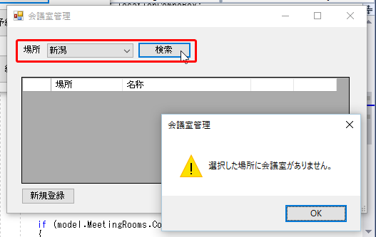
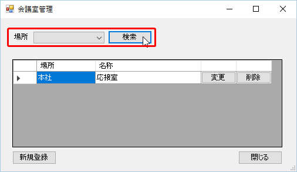

第8章 会議室を検索しよう
=====

[↑目次](../README.md "目次")

[←第7章 会議室を登録しよう](07.md)

会議室が登録できるようになったので、今度は検索してみましょう。これまでの知識があれば、あっという間に作成できます。

## 8.1 会議室一覧画面Modelに検索処理を追加しよう

まず、検索処理を行う`Search`メソッドを作成します。第4章で述べたように、Modelの処理はModel自身の状態を使って行いますので、`Search`メソッドも検索条件は引数では引き渡さず、`Location`プロパティを使うようにします。

**リスト 8-1** 会議室一覧画面Modelクラスの検索処理（MeetingRoomListModel.csより）

```csharp
/// <summary>
/// 会議室を検索します。
/// </summary>
public void Search()
{
    using (var conn = CreateConnection())
    {
        var sql = @"
            select
             *
            from
             MEETING_ROOM MR
              inner join LOCATION LC on LC.ID = MR.LOCATION_ID
            ";

        if (Location.Id.HasValue)
        {
            // 場所が指定されていたら、絞り込み条件を追加する
            sql += @"where MR.LOCATION_ID = :LocationId";
        }

        sql += @"
            order by
             LC.NAME
            ,MR.NAME
            ";

        // 問合せ実行
        // ※DapperのMulti mapping機能を使い、会議室と場所を取得する
        MeetingRooms = conn.Query<MeetingRoom, Location, MeetingRoom>(
            sql,
            (meetingRoom, location) =>
            {
                meetingRoom.Location = location;
                return meetingRoom;
            },
            new { LocationId = Location.Id }
            )
            .ToArray();
    }
}
```

ポイントは、場所が指定された時のみ抽出条件をSQLに追加することと、[DapperのMulti Mapping機能](http://qiita.com/NetSeed/items/dda1096d03dfbf5fe431)を使って、取得された`MeetingRoom`型オブジェクトの`Location`プロパティに、対応する場所の`Location`型オブジェクトを設定していることです。このようにO/Rマッパーの機能を活用することで、SQLの取得結果から自分でオブジェクトを作る作業を行なわずに済むケースもあります。

## 8.2 画面から検索処理を行おう

今度は［検索］ボタンを押したときの処理を作成します。

まず、会議室一覧画面をフォームデザイナーで開き、［検索］ボタンのClickイベントハンドラーを作成します。そして、次のコードを入力します。

**リスト 8-2** 会議室検索処理（MeetingRoomListForm.csより）

```csharp
using System;
using System.Windows.Forms;

using MRRS.Model;
using MRRS.Shared.Entities;

namespace MRRS.View
{
    public partial class MeetingRoomListForm : Form
    {
        ...(省略)...

        private void searchButton_Click(object sender, EventArgs e)
        {
            // 検索条件をModelに反映
            model.Location = locationBindingSource.Current as Location;

            // 検索処理
            model.Search();

            // 検索結果を画面に反映
            meetingRoomBindingSource.DataSource = model.MeetingRooms;
        }
    }
}
```

処理の最初は［場所］で選択された場所を、会議室詳細画面と同様に`BindingSource`コンポーネントの`Current`プロパティを使って取得します。その後、、検索処理を行うModelの`Search`メソッドを呼び出し、検索結果の`MeetingRooms`プロパティを`meetingRoomBindingSource.DataSource`プロパティに設定して画面に表示します。

次に、検索結果が0件だった場合、詳細設計書に書いてあるように「選択した場所に会議室がありません。」という警告メッセージを表示しましょう。上記の処理の最後に、判定処理を警告メッセージ表示処理を追加します。

**リスト 8-3** 会議室検索処理（MeetingRoomListForm.csより）

```csharp
private void searchButton_Click(object sender, EventArgs e)
{
    ...(省略)...

    if (model.MeetingRooms.Count == 0)
    {
        // 検索結果：データなし
        MessageBox.Show(
            "選択した場所に会議室がありません。",
            this.Text,
            MessageBoxButtons.OK,
            MessageBoxIcon.Warning);
    }
}
```

それでは実行して動作を確認しましょう。いつものように会議室一覧画面を表示します。そして、先ほど登録した会議室を検索するため、［場所］で［本社］を選択し、［検索］ボタンをクリックします。すると、場所が本社の会議室が検索され、グリッドに表示されます。


次に、まだ会議室を登録していない場所である［新潟］を指定して［検索］ボタンをクリックします。すると、グリッドがクリアされ、警告メッセージが表示されます。



［場所］を指定しない場合は、すべての会議室が検索されます。



検索もできるようになり、だいぶアプリらしくなってきました。次は変更、削除を行います。

[→第9章 会議室を変更、削除しよう](09.md)
