第9章 会議室を変更、削除しよう
=====

[↑目次](../README.md "目次")

[←第8章 会議室を検索しよう](08.md)

会議室情報の登録、検索ができるようになりましたので、今度は変更および削除できるようにしていきましょう。

## 9.1 会議室を変更しよう

まずは会議室を変更できるようにしましょう。

会議室を変更するには、会議室一覧画面で対象データの［変更］ボタンをクリック→会議室データを取得し会議室詳細画面で表示→［OK］をクリック→会議室データを更新→会議室データ再検索して表示、という順で処理を行います。したがって、次のような変更が必要になります。

- Model
    - 会議室データの取得処理追加
    - 会議室データの更新処理追加
- 画面
    - 会議室詳細画面を変更モードで表示
    - 更新後の再検索処理追加

### Modelの変更

いつものようにModelから順番に対応していきましょう。

最初は会議室データの取得処理を追加します。Modelの`MeetingRoom`プロパティに選択した会議室の`MeetingRoom`クラスインスタンスが設定されるという前提で処理を行います。`MeetingRoomDetailModel`クラスの`Initialize`メソッドに、会議室データを読み込む処理を追加します。

**リスト 9-1** 会議室データ読み込み処理（MeetingRoomDetailModel.csより）

```csharp
/// <summary>
/// 画面起動時の初期処理を行います。
/// </summary>
public void Initialize()
{
    using (var conn = DbProvider.CreateConnection())
    {
        ...(省略)...

        // 初期値設定
        if (EditMode == EditMode.AddNew)
        {
            MeetingRoom = new MeetingRoom();
        }
        else
        {
            // 会議室の最新データを読み込む
            MeetingRoom = conn.Query<MeetingRoom, Location, MeetingRoom>(
                @"
                    select
                     *
                    from
                     MEETING_ROOM MR
                      inner join LOCATION LC on LC.ID = MR.LOCATION_ID
                    where
                     MR.ID = :ID
                ",
                (mr, loc) => { mr.Location = loc; return mr; },
                new { ID = MeetingRoom.Id }
                )
                .Single();
        }
    }
}
```

`MeetingRoomDetailModel`クラスの`Search`メソッドと同様、会議室データを取得する際、場所データもともに取得し、`MeetingRoom`クラスのインスタンスとして扱います。そのため、Dapperには単一行を取得するための`QuerySingle`メソッドもありますが、あえて`Query`メソッドを実行し、その後LINQの`Single`メソッドで`IEnumerable<MeetingRoom>`型から`MeetingRoom`型のインスタンスを取り出します。

次に会議室の変更処理です。これも既存の`Update`メソッドに、編集モードが変更の場合の処理を追加します。

**リスト 9-2** 会議室データ変更処理（MeetingRoomDetailModel.csより）

```csharp
/// <summary>
/// 会議室データを更新します。
/// </summary>
public void Update()
{
    using (var conn = DbProvider.CreateConnection())
    {
        switch (EditMode)
        {
            case EditMode.AddNew:

                ...(省略)...

            case EditMode.Modify:
                conn.Execute(@"
                    update MEETING_ROOM
                    set
                     NAME = :Name
                    ,LOCATION_ID = :LocationId
                    where
                     ID = :Id
                    ",
                    MeetingRoom);
                break;
        }
    }
}
```

なお、会議室一覧画面で選んだ`MeetingRoom`クラスインスタンスを使って再検索する都合上、現在の`EditMode`型だけでなく、`MeetingRoom`型の引数を持つコンストラクターも追加します。元々あったコンストラクターは今回追加するコンストラクターを呼び出すようコードを修正します。

**リスト 9-3** 会議室データを受け取るコンストラクターを追加（MeetingRoomDetailModel.csより）

```csharp
public MeetingRoomDetailModel(EditMode editMode) : this(editMode, null)
{
}

public MeetingRoomDetailModel(EditMode editMode, MeetingRoom meetingRoom)
{
    EditMode = editMode;
    MeetingRoom = meetingRoom;
}
```

### 画面の変更

次に画面を変更しましょう。

まず［変更］ボタンをクリックした際の処理から作成します。会議室一覧画面をフォームデザイナーで開き、グリッドをダブルクリックします。

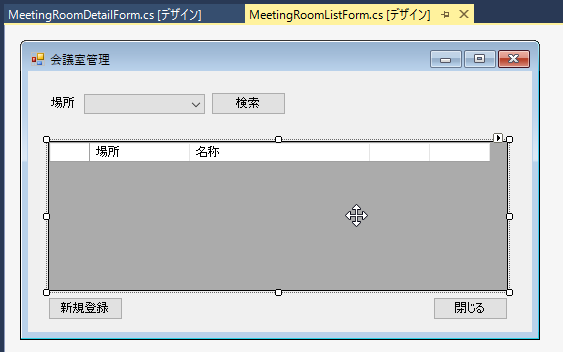

`CellContentClick`イベントハンドラーが作成されるので、次のようにコードを入力します。

**リスト 9-4** 変更ボタンクリック処理（MeetingRoomListForm.csより）

```csharp
private void meetingRoomDataGridView_CellContentClick(object sender, DataGridViewCellEventArgs e)
{
    // データがなければ中断
    if (e.RowIndex < 0) return;

    // クリックした列が［変更］ボタンでなければ中断
    if (e.ColumnIndex != 2) return;

    // 対象会議室データを取得
    var meetingRoom = meetingRoomBindingSource.Current as MeetingRoom;

    using (var form = new MeetingRoomDetailForm(EditMode.Modify, meetingRoom))
    {
        var dialogResult = form.ShowDialog();
    }
}
```

会議室詳細画面のコンストラクターに`EditMode`型と`MeetingRoom`型の引数を2つ渡していますが、まだ定義されていませんので赤波線が表示されます。電球アイコンをクリックして、コンストラクターを生成しましょう。

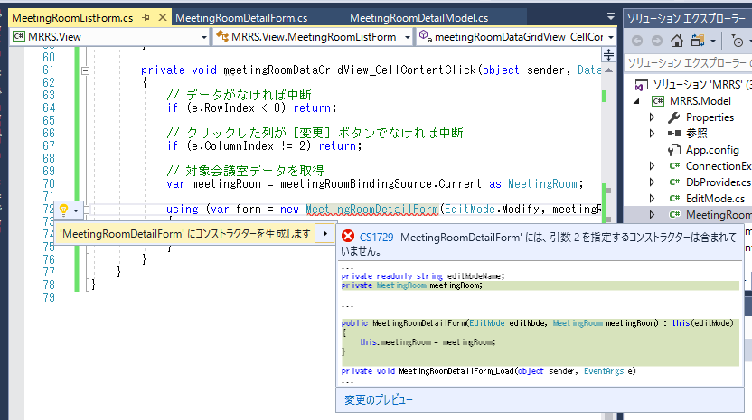

生成した後、`new MeetingRoom`にカーソルがある状態で`F12`キーを押して定義に移動します。もしくは`Alt`+`F12`キーを押して［定義をここに表示］してもよいでしょう。

そして、生成されたコンストラクターと既存のコンストラクターを編集し、次の2つのコンストラクターを作成します。

**リスト 9-5** 会議室を受け取るコンストラクター追加（MeetingRoomDetailForm.csより）

```csharp
...(省略)...

namespace MRRS.View
{
    public partial class MeetingRoomDetailForm : Form
    {
        public MeetingRoomDetailForm()
        {
            InitializeComponent();
        }

        private MeetingRoomDetailModel model;
        private readonly string editModeName;

        public MeetingRoomDetailForm(EditMode editMode) : this(editMode, null)
        {
        }

        public MeetingRoomDetailForm(EditMode editMode, MeetingRoom meetingRoom) : this()
        {
            model = new MeetingRoomDetailModel(editMode, meetingRoom);

            // ウィンドウタイトル設定
            editModeName =
                model.EditMode == EditMode.AddNew ? "登録" :
                model.EditMode == EditMode.Modify ? "変更" :
                                                    "削除";
        }

        ...(省略)...

    }
}
```

また、渡された会議室データの名称を画面の［名称］に設定するため、フォームの`Load`イベントハンドラーにも変更を加えます。

**リスト 9-6** 会議室名の表示（MeetingRoomDetailForm.csより）

```csharp
private void MeetingRoomDetailForm_Load(object sender, EventArgs e)
{
    ...(省略)...

    nameTextBox.Text = model.MeetingRoom.Name;

    Text = $"会議室{editModeName}";

    ...(省略)...
}
```

次に会議室データ更新後の再検索処理を作成します。既に作成済みの［検索］ボタンのClickイベントハンドラーの中身を［メソッドの抽出」で`Search`メソッドに切り出します。

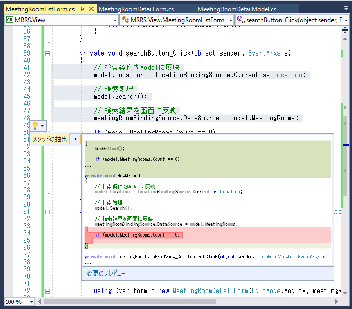

↓

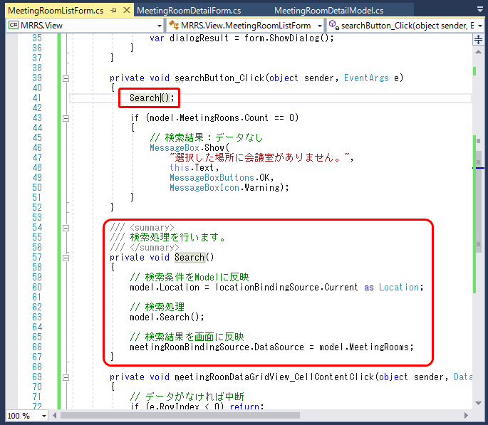

グリッドの`CellContentClick`イベントハンドラーに、会議室詳細画面の結果を判定して再検索処理を行うコードを追加します。

**リスト 9-7** 会議室データ更新後の再検索（MeetingRoomListForm.csより）

```csharp
private void meetingRoomDataGridView_CellContentClick(object sender, DataGridViewCellEventArgs e)
{
    ...(省略)...

    using (var form = new MeetingRoomDetailForm(EditMode.Modify, meetingRoom))
    {
        var dialogResult = form.ShowDialog();

        if (
            dialogResult == DialogResult.OK &&
            model.MeetingRooms.Any()
            )
        {
            // 検索データがあれば再検索
            Search();
        }
    }
}
```

なお、検索ボタンを押していないか、押していてもデータが無ければ再検索を行う必要はないので、その判定をModelの`MeetingRooms`プロパティに対して、LINQの`Any`メソッドを使って行っています。`Any`メソッドはその引数に条件を指定することで、対象のコレクションに条件に合致するものがあれば`true`を返しますが、引数を指定しない場合はコレクションに要素があれば`true`を返す動作になるため、これを利用しています。

この再検索処理は［新規登録］ボタンの方でも必要なので、次のコードのように追加しておきましょう。

**リスト 9-8** 会議室データ登録後の再検索（MeetingRoomListForm.csより）

```csharp
private void addNewButton_Click(object sender, EventArgs e)
{
    using (var form = new MeetingRoomDetailForm(EditMode.AddNew))
    {
        var dialogResult = form.ShowDialog();

        if (
           dialogResult == DialogResult.OK &&
           model.MeetingRooms.Any()
           )
        {
            // 検索データがあれば再検索
            Search();
        }
    }
}
```

## 9.2 会議室を削除しよう

今度は会議室を削除できるようにしましょう。とはいえ、下準備は変更の時にほぼ終わっているので、少し変更を加えればOKです。

## Modelの変更

`Update`メソッドに編集モードが削除の時の処理を追加します。

**リスト 9-9** 会議室データ削除処理（MeetingRoomDetailModel.csより）

```csharp
/// <summary>
/// 会議室データを更新します。
/// </summary>
public void Update()
{
    using (var conn = DbProvider.CreateConnection())
    {
        switch (EditMode)
        {
            case EditMode.AddNew:

                ...(省略)...

            case EditMode.Modify:

                ...(省略)...

            case EditMode.Delete:
                conn.Execute(@"
                    delete from MEETING_ROOM
                    where
                     ID = :Id
                    ",
                    MeetingRoom);
                break;
        }
    }
}
```

## 画面の変更

画面の変更は次の2つ必要です。

- ［削除］ボタンをクリックしたら処理をする
- 削除モードでは会議室詳細画面の［場所］と［名称］を変更できなくする

まず、会議室一覧画面のグリッドの`CellContentClick`イベントハンドラーを変更し、［削除］ボタンをクリックしたら削除モードとして会議室詳細画面を表示するよう変更します。

**リスト 9-10** 削除ボタンクリック処理（MeetingRoomListForm.csより）

```csharp
private void meetingRoomDataGridView_CellContentClick(object sender, DataGridViewCellEventArgs e)
{
    ...(省略)...

    // クリックした列が［変更］、［削除］ボタンでなければ中断
    if (e.ColumnIndex != 2 && e.ColumnIndex != 3) return;

    ...(省略)...

    var editMode = e.ColumnIndex == 2 ? EditMode.Modify :
                                        EditMode.Delete;

    using (var form = new MeetingRoomDetailForm(editMode, meetingRoom))
    {
        ...(省略)...
    }
}
```

次に会議室詳細画面のフォーム`Load`イベントハンドラーを変更し、削除モードなら画面項目をブロックするようにします。

**リスト 9-11** 削除モード時の項目ブロック（MeetingRoomDetailForm.csより）

```csharp
private void MeetingRoomDetailForm_Load(object sender, EventArgs e)
{
    ...(省略)...

    if (model.EditMode == EditMode.Delete)
    {
        // 項目をブロック
        locationComboBox.Enabled = false;
        nameTextBox.ReadOnly = true;

        // 初期フォーカス設定
        ActiveControl = okButton;
    }
    else
    {
        // 初期フォーカス設定
        ActiveControl = locationComboBox;
    }
}
```

## 9.3 動作を確認しよう

それでは、会議室を新規登録→変更→削除してみましょう。いつものように会議室一覧画面を表示し、［検索］ボタンをクリックして会議室をグリッドに表示します。そのままの状態で［新規登録］ボタンをクリックします。

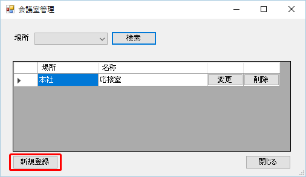

［会議室登録］画面で、［場所］を［新潟］、［名称］を"第1会議室"と入力して、［OK］ボタンをクリックします。その後、確認ダイアログが表示されるので［はい］をクリックします。

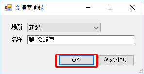

会議室一覧画面に戻ると、会議室データが再検索され、今登録した場所がグリッドに追加されます。

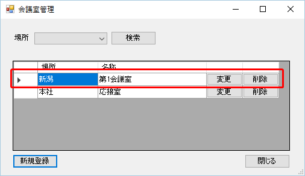

次に、［場所］を［新潟］に変更して再度検索します。その後、［変更］ボタンをクリックして、［会議室変更］画面を表示します。

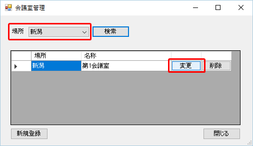

［場所］を［東京］、［名称］を"第2会議室"に変更して、［OK］ボタンをクリックします。

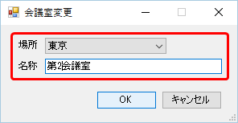

確認メッセージが［変更します。よろしいですか？」になっていることが確認できます。

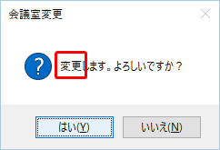

更新後はまた会議室データが検索されますが、［新潟］の会議室はないのでグリッドは空になります。


変更結果を確認するため、［場所］を［東京］に変更して［検索］ボタンをクリックします。すると、先ほど変更した会議室が検索、表示されるので、［削除］ボタンをクリックします。

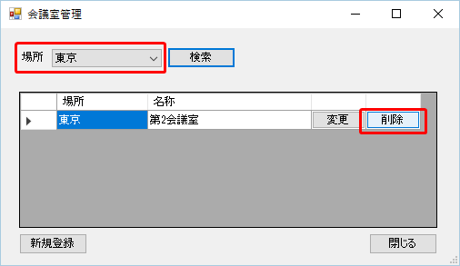

［会議室削除］画面が表示され、［場所］と［名称］が変更できないようにブロックされていることが確認できます。また、フォーカスも新規登録、変更と違い、［OK］ボタンに設定されています。

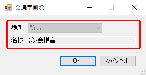

そのまま［OK］ボタンをクリックし、削除確認ダイアログでも［はい］をクリックして、会議室を削除しましょう。会議室一覧画面に戻ると、［東京］の会議室がなくなったため、グリッドは空で表示されます。

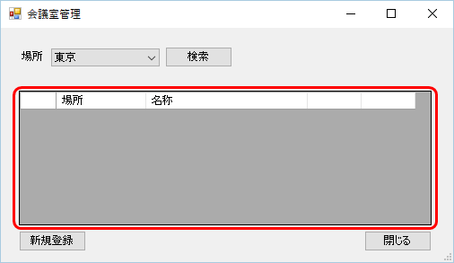

本当に削除できたか確認するため、［場所］を空にして［検索］ボタンをクリックします。元々登録されていた、「本社の応接室」だけが検索、表示され、確かに削除されたことが確認できます。


これで、会議室の登録と、参照、変更、削除ができるようになり、基本的な管理は行えるようになりました。ただ、まだ全く入力チェックを行っていないので、次の章でチェック処理を作成しましょう。

[→第10章 入力チェックを行おう](10.md)
