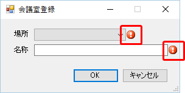
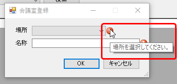
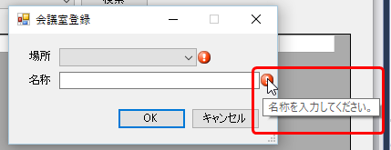
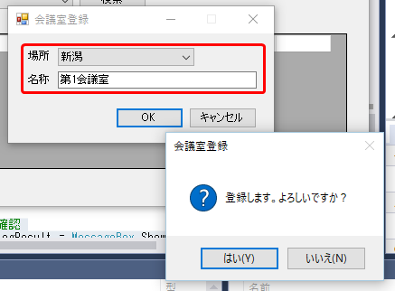
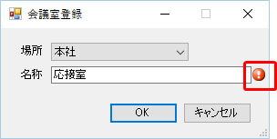
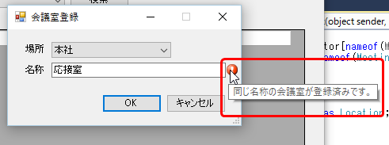
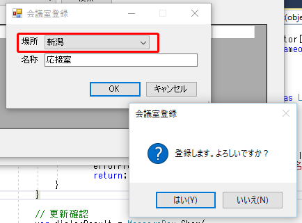
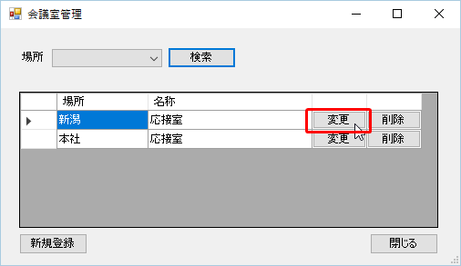
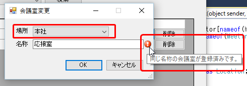
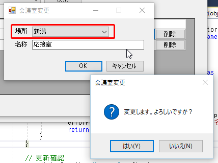

第10章 入力チェックを行おう
=====

[↑目次](../README.md "目次")

[←第9章 会議室を変更、削除しよう](09.md)

アプリを使ってデータを操作できるようになりました。こんどはシステムの整合性の確保と、ユーザーの利便性のため、入力チェックを行ないましょう。

入力チェックは大きく「単体入力チェック」と「突合せチェック」に分けることができます（参考：[エラーチェックの体系的な分類方法 – とあるコンサルタントのつぶやき](https://blogs.msdn.microsoft.com/nakama/2009/09/28/293/)）。順に作成していきましょう。

## 10.1 単体入力チェックを作成しよう

最初は画面の項目のみで妥当性が判定できる、「単体入力チェック」を作成していきます。
本サンプルアプリでは、単体入力チェックの結果は各項目の脇にエラーアイコンを表示することで表現します。これは、`ErrorProvider`コンポートネントを用いることで実現できます。

### 単体入力チェック用クラス作成

まず、フォーム内に検証処理を書いてしまうとフォームの処理が煩雑になってしまうので、専用のクラスを作って単体入力チェックを行わせましょう。今回は、`IDataError`インターフェースを実装したクラスとして、`MRRS.View`プロジェクト内に作成します。

**リスト 10-1** 会議室詳細画面入力チェック用クラス（MeetingRoomDetailValidator.csより）

```csharp
using System.Collections.Generic;
using System.ComponentModel;
using System.Linq;

using MRRS.Shared.Entities;

namespace MRRS.View
{
    /// <summary>
    /// 会議室詳細画面の単体入力エラーチェックを行います。
    /// </summary>
    public class MeetingRoomDetailValidator : IDataErrorInfo
    {
        /// <summary>
        /// エラー情報ストア。
        /// </summary>
        private IDictionary<string, string> errors = new Dictionary<string, string>();

        /// <summary>
        /// チェック対象データを使ってMeetingRoomDetailValidatorクラスの新しいインスタンスを初期化します。
        /// </summary>
        /// <param name="locationSelectedIndex">場所（選択インデックス）。</param>
        /// <param name="name">名称。</param>
        public MeetingRoomDetailValidator(int locationSelectedIndex, string name)
        {
            if (locationSelectedIndex == -1)
            {
                errors[nameof(Location)] = "場所を選択してください。";
            }

            if (string.IsNullOrWhiteSpace(name))
            {
                errors[nameof(MeetingRoom.Name)] = "名称を入力してください。";
            }
        }

        /// <summary>
        /// 指定した名前を持つプロパティのエラーメッセージを取得します。
        /// </summary>
        /// <param name="columnName"></param>
        /// <returns></returns>
        public string this[string columnName] =>
            errors.TryGetValue(columnName, out var message) ? message : null;

        /// <summary>
        /// インスタンス単位の単体入力エラーを返します。
        /// </summary>
        public string Error => "";

        /// <summary>
        /// 単体入力エラーがあるかどうか判定します。
        /// </summary>
        public bool HasError => errors.Any();
    }
}
```

チェック対象項目の値はコンストラクターで引き渡し、チェック結果を`Dictionary<string, string>`型の`errors`フィールドに保存します。その際のキーには、`nameof`演算子を使い、対応するクラスやプロパティ名を使うようにしています。これは、将来名前が変更されたとしても、コードへの影響を極力少なくするためです。

チェック結果を取り出すには、`IDataErrorInfo`インターフェースの`string this[string columnName]`インデクサーを実装します。今回は取得だけ行えれば良いので、Expression-bodiedな記述を行っています。取得の際は`IDictionary<TKey, TValue>`インターフェイスに用意された`TryGetValue`メソッドを使い、キーに対応するエラーが登録されていればその内容を、登録されていなければnullを返すようにしています。

その他、会議室詳細画面のケースでは複数項目の組み合わせチェック（インスタンス単位のチェック）はないので、`IDataErrorInfo`インターフェイスの`Error`プロパティは常に空文字を返しています。

また、エラーがあるかどうかを簡単に判定するため、`HasError`プロパティを用意し、`errors`フィールドに登録されているかどうかをLINQの`Any`メソッドで判定しています。

### 単体入力チェック用クラスの利用

次に単体入力チェック用クラスを画面に組み込み、実際にチェックを行ってみましょう。

会議室詳細画面の［OK］ボタンの`Click`イベントハンドラーにて、Modelに入力値を反映する前に、入力チェックを行なうようコードを変更します。なお、削除モードの時は入力チェック不要なのでスキップするようにもしています。

**リスト 10-2** 画面に単体入力チェックを組み込み（MeetingRoomDetailForm.csより）

```csharp
private void okButton_Click(object sender, EventArgs e)
{
    if (model.EditMode != EditMode.Delete)
    {
        // 単体入力エラーチェック
        var validator = new MeetingRoomDetailValidator(
            locationComboBox.SelectedIndex, nameTextBox.Text);
        // チェック結果表示
        errorProvider.SetError(locationComboBox, validator[nameof(Shared.Entities.Location)]);
        errorProvider.SetError(nameTextBox, validator[nameof(MeetingRoom.Name)]);
        // エラーがあった場合は処理中断
        if (validator.HasError) return;

        // 画面の入力をModelに反映
        model.Location = locationBindingSource.Current as Location;
        model.MeetingRoom.Name = nameTextBox.Text;
    }

    // 更新確認
    ...(省略)...
}
```

まず、単体入力チェック用クラスのインスタンスを作成します。この時、画面のコントロールから、チェックに必要な値をコンストラクターで渡します。このコードでは、［場所］の`SelectedIndex`プロパティと［名称］の`Text`プロパティです。

インスタンス作成と同時にチェックが行われるので、次はチェック結果を画面に設定します。`ErrorProvider`コンポーネントの`SetError`メソッドに対象のコントロールとエラーメッセージを渡して呼び出すことで、エラーを設定できます。エラーがない項目では、単体入力チェック用クラスのインデクサーによってnullが返ってきます。したがって、`SetError`メソッドにnullが渡されるため、エラーメッセージが消えます。

エラー内容を画面に設定したら、エラーの有無を判定し、エラーがあれば処理を中断します。そして、エラーが無ければここで初めて入力値をModelに反映させます。単体入力チェックでエラーがあるということは、異常な状態にあるということなので、Modelの処理を行うことはできないためです。

### 動作を確認しよう

それでは、単体入力チェックの動作を確認しましょう。アプリを起動して会議室一覧画面を表示したら、［新規登録］ボタンを押して登録モードで会議室詳細画面を表示します。そして、［場所］が未選択、［名称］が未入力のまま［OK］ボタンをクリックすると、それぞれの項目の脇にエラーアイコンが表示され、処理が中断されます。



このエラーアイコンにマウスカーソルをポイントすると、それぞれのエラー内容が表示されます。





［場所］と［名称］を入力して［OK］ボタンを押すと、今度はエラーが表示されずに登録確認ダイアログが表示されます。



## 10.2 突合せチェックを作成しよう

次は画面以外（例えばDB）の情報を使ってチェックを行う、「突合せチェック」を作成していきます。

突合せチェックは業務ロジックの一部ともいえるので、Modelに実装します。更新処理などの中で行う手もありますが、今回はチェック後に確認ダイアログを表示する必要があるので、更新処理とは分けて`Validate`メソッドとして実装します。もちろん、規模が大きかったり、複数のModelで共有するような突合せチェックなら、個別のクラスにしてもよいでしょう。

**リスト 10-3** 突合せチェックメソッド（MeetingRoomDetailModel.csより）

```csharp
using System.Collections.Generic;
using System.Linq;

using Dapper;

using MRRS.Shared.Entities;

namespace MRRS.Model
{
    /// <summary>
    /// 会議室詳細画面のModelクラスです。
    /// </summary>
    public class MeetingRoomDetailModel
    {
        ...(省略)...

        /// <summary>
        /// 検証結果。
        /// </summary>
        public enum ValidateResult
        {
            /// <summary>
            /// 正常
            /// </summary>
            Success,

            /// <summary>
            /// 重複データあり
            /// </summary>
            Duplication
        }

        /// <summary>
        /// 突合せチェックを行います。
        /// </summary>
        /// <returns></returns>
        public ValidateResult Validate()
        {
            if (EditMode == EditMode.Delete) return ValidateResult.Success;

            using (var conn = DbProvider.CreateConnection())
            {
                if (ExistsDuplication(conn)) return ValidateResult.Duplication;
            }

            return ValidateResult.Success;
        }

        /// <summary>
        /// 重複データが存在するか判定します。
        /// </summary>
        /// <param name="conn"></param>
        /// <returns>重複データが存在した場合true、そうでなければfalse。</returns>
        private bool ExistsDuplication(System.Data.IDbConnection conn)
        {
            // 重複データが存在するかチェック
            var sql = @"
                select
                    count(ID)
                from
                    MEETING_ROOM
                where
                    LOCATION_ID = :LocationId
                    and NAME = :Name
                ";
            if (EditMode != EditMode.AddNew)
            {
                sql += @"
                    and ID <> :Id
                    ";
            }

            var count = conn.ExecuteScalar<int>(sql, MeetingRoom);

            return (count > 0);
        }
    }
}
```

突合せチェックは項目単位というよりは全体でチェックを行うことが多く、その場合結果は一つになります。そのため、専用の`ValidateResult`列挙型（列挙子は`Success`（成功）、`Duplication`（重複あり）の2つ）をModelの内部に定義して使用します。これは、こうすることで、それぞれのModel専用の結果を表す列挙型ということが明示できるためです。

今回は一つの場所に同じ名称の会議室が登録できないようにするため、画面の［場所］、［名称］を使って、既存の会議室データを検索し、データがあったらエラーとしています。また、変更モードでは、現在編集中のデータはチェック対象から除外しないといけませんので、`ID`が編集中の`Id`とは異なるという条件を追加しています。

### 突合せチェックの利用

次に突合せを画面に組み込んでみましょう。

会議室詳細画面の［OK］ボタンの`Click`イベントハンドラーにて、Modelに入力値を**反映した後**に、突合せチェックを行なうコードを変更します。

**リスト 10-4** 画面に突合せチェックを組み込み（MeetingRoomDetailForm.csより）

```csharp
private void okButton_Click(object sender, EventArgs e)
{
    if (model.EditMode != EditMode.Delete)
    {
        ...(省略)...

        // 突合せチェック
        switch (model.Validate())
        {
            case MeetingRoomDetailModel.ValidateResult.Duplication:
                errorProvider.SetError(nameTextBox, "同じ名称の会議室が登録済みです。");
                return;
        }
    }

    ...(省略)...
}
```

`Validate`メソッドの戻り値は列挙型なので、そのまま`switch`文を使って判定を行います。判定するのはエラーがあるときだけで構わないので、`Duplication`の場合にエラーメッセージを表示し、処理を中断するようにしています。
エラーメッセージはケースバイケースで表示方法を変えることになりますが、今回は［名称］に関する突合せチェックなので、［名称］の脇に単体入力チェックと同様にエラーアイコンを表示します。

### 動作を確認しよう

それでは、突合せチェックの動作も確認しましょう。アプリを起動して会議室一覧画面を表示したら、［新規登録］ボタンを押して登録モードで会議室詳細画面を表示します。そして、［場所］を［本社］、［名称］を"応接室"にして［OK］ボタンをクリックすると、［名称］の脇にエラーアイコンが表示され、処理が中断されます。



このエラーアイコンにマウスカーソルをポイントすると、突合せチェックのエラー内容が表示されます。



［場所］を［新潟］にしてから［OK］ボタンをクリックすると、今度はエラーにならずに確認ダイアログが表示されます。そのまま［はい］ボタンをクリックして、会議室を登録します。



次に、会議室一覧画面に戻ったら［検索］ボタンをクリックして会議室を検索、表示した後、今登録した会議室の［変更］ボタンをクリックして会議室詳細画面を変更モードで表示します。



［場所］を［新潟］から［本社］に変更して［OK］ボタンをクリックすると、突合せチェックエラーが表示されます。



［場所］を元の［新潟］に戻して［OK］ボタンをクリックすると、現在編集中のデータの他に同じ名前の会議室はないため、突合せチェックはエラーとならず、変更確認ダイアログが表示されます。




これでデータを安全に登録、変更、削除できるようになりました。後は、まだ実装していない各種の処理を実装したら、会議室管理機能は完成です。

[→第11章 アプリを完成させよう](11.md)
