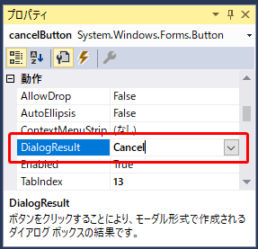
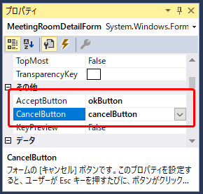
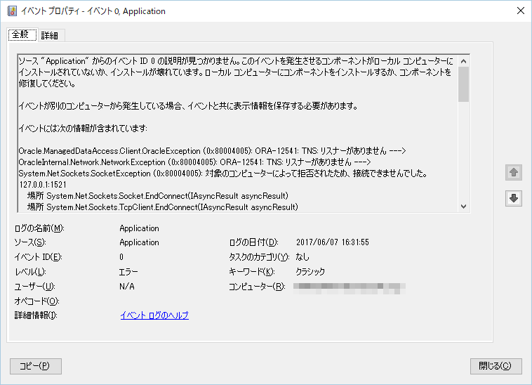

第11章 アプリを完成させよう
=====

[↑目次](../README.md "目次")

[←第10章 入力チェックを行おう](10.md)

最後に、まだ実装していない処理を実装してアプリを完成させましょう。

## 11.1 メニューの終了処理を作成しよう

［終了］ボタンをクリックしたらメニューを終了するようにしましょう。メニュー画面の［終了］ボタンの`Click`イベントハンドラーを作成し、次のようにコードを入力します。

**リスト 11-1** アプリ終了処理（MenuForm.csより）

```csharp
private void closeButton_Click(object sender, EventArgs e)
{
    Close();
}
```

## 11.2 会議室管理の終了処理を作成しよう

メニュー画面と同様に、会議室一覧画面の［閉じる］ボタンも実装します。

**リスト 11-2** 会議実管理終了処理（MeetingRoomListForm.csより）

```csharp
private void closeButton_Click(object sender, EventArgs e)
{
    Close();
}
```

## 11.3 会議室詳細画面のキャンセル処理を作成しよう

会議室詳細画面の［キャンセル］ボタンを押したときは、何もせずに画面を閉じます。また、`DialogResult`プロパティに`Cancel`を設定する必要があります。

こんな時は、フォームデザイナーで`Button`コントロールの`DialogResult`プロパティを設定します。



また、ダイアログとして動作させるので、「実行」、「キャンセル」をボタンでなくキーボードでも設定できると便利です。フォームの`AcceptButton`、`CancelButton`プロパティにそれぞれ［OK］ボタンと［キャンセル］ボタンを割り当てることで、`Enter`キーを押すと［OK］ボタン、`Esc`キーを押すと［キャンセル］ボタンの処理が行わるようになります。



## 11.4 システムエラーに対応しよう

最後に、システムエラーへも対応しておきましょう。システムエラーに対応するには、「集約例外ハンドラー」を使います（参考：[第6章 それはできません - GUIプログラミング入門 by Windows Forms](https://github.com/masaru-b-cl/introduction-to-winforms-programming/blob/master/doc/06-cannot-do-it.md)）。

`Program`クラスの`Main`メソッドに、集約例外ハンドラーを実装します。

**リスト 11-3** システムエラーへの対応（Program.csより）

```csharp
using System;
using System.Diagnostics;
using System.Windows.Forms;

namespace MRRS.View
{
    static class Program
    {
        /// <summary>
        /// アプリケーションのメイン エントリ ポイントです。
        /// </summary>
        [STAThread]
        static void Main()
        {
            Application.ThreadException += (sender, e) =>
            {
                MessageBox.Show(
                    "予期せぬエラーが発生しました。詳細はイベントログを確認して下さい。",
                    "会議室予約システム",
                    MessageBoxButtons.OK,
                    MessageBoxIcon.Stop);

                EventLog.WriteEntry(
                    "Application",
                    e.Exception.ToString(),
                    EventLogEntryType.Error
                    );

                Application.Exit();
            };

            Application.EnableVisualStyles();
            Application.SetCompatibleTextRenderingDefault(false);
            Application.Run(new MenuForm());
        }
    }
}
```

例えば、DBに接続できないときなどに、システムエラーとなり、専用ダイアログが表示されます。


システムエラーの内容（例外のスタックトレース）はイベントビューアーで確認できます。



```
ログの名前:         Application
ソース:           Application
日付:            2017/06/07 16:31:55
イベント ID:       0
タスクのカテゴリ:      なし
レベル:           エラー
キーワード:         クラシック
ユーザー:          N/A
コンピューター:       xxxxx.example.com
説明:
ソース "Application" からのイベント ID 0 の説明が見つかりません。このイベントを発生させるコンポーネントがローカル コンピューターにインストールされていないか、インストールが壊れています。ローカル コンピューターにコンポーネントをインストールするか、コンポーネントを修復してください。

イベントが別のコンピューターから発生している場合、イベントと共に表示情報を保存する必要があります。

イベントには次の情報が含まれています: 

Oracle.ManagedDataAccess.Client.OracleException (0x80004005): ORA-12541: TNS: リスナーがありません ---> OracleInternal.Network.NetworkException (0x80004005): ORA-12541: TNS: リスナーがありません ---> System.Net.Sockets.SocketException (0x80004005): 対象のコンピューターによって拒否されたため、接続できませんでした。 127.0.0.1:1521
   場所 System.Net.Sockets.Socket.EndConnect(IAsyncResult asyncResult)
   場所 System.Net.Sockets.TcpClient.EndConnect(IAsyncResult asyncResult)
   場所 OracleInternal.Network.TcpTransportAdapter.Connect(ConnectionOption conOption)
   場所 OracleInternal.Network.OracleCommunication.DoConnect(String tnsDescriptor)
   場所 OracleInternal.Network.OracleCommunication.Connect(String tnsDescriptor, Boolean doNAHandshake, String IName)
   場所 OracleInternal.ServiceObjects.OracleConnectionImpl.Connect(ConnectionString cs, Boolean bOpenEndUserSession, CriteriaCtx criteriaCtx, String instanceName)
   場所 OracleInternal.ConnectionPool.PoolManager`3.Get(ConnectionString csWithDiffOrNewPwd, Boolean bGetForApp, CriteriaCtx criteriaCtx, String affinityInstanceName, Boolean bForceMatch)
   場所 OracleInternal.ConnectionPool.OraclePoolManager.Get(ConnectionString csWithNewPassword, Boolean bGetForApp, CriteriaCtx criteriaCtx, String affinityInstanceName, Boolean bForceMatch)
   場所 OracleInternal.ConnectionPool.OracleConnectionDispenser`3.Get(ConnectionString cs, PM conPM, ConnectionString pmCS, SecureString securedPassword, SecureString securedProxyPassword, CriteriaCtx criteriaCtx)
   場所 Oracle.ManagedDataAccess.Client.OracleConnection.Open()
   場所 Dapper.SqlMapper.<QueryImpl>d__125`1.MoveNext()
   場所 System.Collections.Generic.List`1..ctor(IEnumerable`1 collection)
   場所 System.Linq.Enumerable.ToList[TSource](IEnumerable`1 source)
   場所 Dapper.SqlMapper.Query[T](IDbConnection cnn, String sql, Object param, IDbTransaction transaction, Boolean buffered, Nullable`1 commandTimeout, Nullable`1 commandType)
   場所 MRRS.Model.ConnectionExtensions.SelectLocations(IDbConnection conn) 場所 C:\Users\takano-s\Documents\Visual Studio 2017\Projects\MRRS\MRRS.Model\ConnectionExtensions.cs:行 17
   場所 MRRS.Model.MeetingRoomListModel.Initialize() 場所 C:\Users\takano-s\Documents\Visual Studio 2017\Projects\MRRS\MRRS.Model\MeetingRoomListModel.cs:行 40
   場所 MRRS.View.MeetingRoomListForm.MeetingRoomListForm_Load(Object sender, EventArgs e) 場所 C:\Users\takano-s\Documents\Visual Studio 2017\Projects\MRRS\MRRS.View\MeetingRoomListForm.cs:行 22
   場所 System.Windows.Forms.Form.OnLoad(EventArgs e)
   場所 System.Windows.Forms.Form.OnCreateControl()
   場所 System.Windows.Forms.Control.CreateControl(Boolean fIgnoreVisible)
   場所 System.Windows.Forms.Control.CreateControl()
   場所 System.Windows.Forms.Control.WmShowWindow(Message& m)
   場所 System.Windows.Forms.Control.WndProc(Message& m)
   場所 System.Windows.Forms.ScrollableControl.WndProc(Message& m)
   場所 System.Windows.Forms.Form.WmShowWindow(Message& m)
   場所 System.Windows.Forms.Form.WndProc(Message& m)
   場所 System.Windows.Forms.Control.ControlNativeWindow.OnMessage(Message& m)
   場所 System.Windows.Forms.Control.ControlNativeWindow.WndProc(Message& m)
   場所 System.Windows.Forms.NativeWindow.Callback(IntPtr hWnd, Int32 msg, IntPtr wparam, IntPtr lparam)

メッセージ リソースは存在しますが、メッセージが文字列テーブル/メッセージ テーブルに見つかりません。

イベント XML:
<Event xmlns="http://schemas.microsoft.com/win/2004/08/events/event">
  <System>
    <Provider Name="Application" />
    <EventID Qualifiers="0">0</EventID>
    <Level>2</Level>
    <Task>0</Task>
    <Keywords>0x80000000000000</Keywords>
    <TimeCreated SystemTime="2017-06-07T07:31:55.672564700Z" />
    <EventRecordID>139311</EventRecordID>
    <Channel>Application</Channel>
    <Computer>xxxxx.example.com</Computer>
    <Security />
  </System>
  <EventData>
    <Data>Oracle.ManagedDataAccess.Client.OracleException (0x80004005): ORA-12541: TNS: リスナーがありません ---&gt; OracleInternal.Network.NetworkException (0x80004005): ORA-12541: TNS: リスナーがありません ---&gt; System.Net.Sockets.SocketException (0x80004005): 対象のコンピューターによって拒否されたため、接続できませんでした。 127.0.0.1:1521
   場所 System.Net.Sockets.Socket.EndConnect(IAsyncResult asyncResult)
   場所 System.Net.Sockets.TcpClient.EndConnect(IAsyncResult asyncResult)
   場所 OracleInternal.Network.TcpTransportAdapter.Connect(ConnectionOption conOption)
   場所 OracleInternal.Network.OracleCommunication.DoConnect(String tnsDescriptor)
   場所 OracleInternal.Network.OracleCommunication.Connect(String tnsDescriptor, Boolean doNAHandshake, String IName)
   場所 OracleInternal.ServiceObjects.OracleConnectionImpl.Connect(ConnectionString cs, Boolean bOpenEndUserSession, CriteriaCtx criteriaCtx, String instanceName)
   場所 OracleInternal.ConnectionPool.PoolManager`3.Get(ConnectionString csWithDiffOrNewPwd, Boolean bGetForApp, CriteriaCtx criteriaCtx, String affinityInstanceName, Boolean bForceMatch)
   場所 OracleInternal.ConnectionPool.OraclePoolManager.Get(ConnectionString csWithNewPassword, Boolean bGetForApp, CriteriaCtx criteriaCtx, String affinityInstanceName, Boolean bForceMatch)
   場所 OracleInternal.ConnectionPool.OracleConnectionDispenser`3.Get(ConnectionString cs, PM conPM, ConnectionString pmCS, SecureString securedPassword, SecureString securedProxyPassword, CriteriaCtx criteriaCtx)
   場所 Oracle.ManagedDataAccess.Client.OracleConnection.Open()
   場所 Dapper.SqlMapper.&lt;QueryImpl&gt;d__125`1.MoveNext()
   場所 System.Collections.Generic.List`1..ctor(IEnumerable`1 collection)
   場所 System.Linq.Enumerable.ToList[TSource](IEnumerable`1 source)
   場所 Dapper.SqlMapper.Query[T](IDbConnection cnn, String sql, Object param, IDbTransaction transaction, Boolean buffered, Nullable`1 commandTimeout, Nullable`1 commandType)
   場所 MRRS.Model.ConnectionExtensions.SelectLocations(IDbConnection conn) 場所 C:\Users\takano-s\Documents\Visual Studio 2017\Projects\MRRS\MRRS.Model\ConnectionExtensions.cs:行 17
   場所 MRRS.Model.MeetingRoomListModel.Initialize() 場所 C:\Users\takano-s\Documents\Visual Studio 2017\Projects\MRRS\MRRS.Model\MeetingRoomListModel.cs:行 40
   場所 MRRS.View.MeetingRoomListForm.MeetingRoomListForm_Load(Object sender, EventArgs e) 場所 C:\Users\takano-s\Documents\Visual Studio 2017\Projects\MRRS\MRRS.View\MeetingRoomListForm.cs:行 22
   場所 System.Windows.Forms.Form.OnLoad(EventArgs e)
   場所 System.Windows.Forms.Form.OnCreateControl()
   場所 System.Windows.Forms.Control.CreateControl(Boolean fIgnoreVisible)
   場所 System.Windows.Forms.Control.CreateControl()
   場所 System.Windows.Forms.Control.WmShowWindow(Message&amp; m)
   場所 System.Windows.Forms.Control.WndProc(Message&amp; m)
   場所 System.Windows.Forms.ScrollableControl.WndProc(Message&amp; m)
   場所 System.Windows.Forms.Form.WmShowWindow(Message&amp; m)
   場所 System.Windows.Forms.Form.WndProc(Message&amp; m)
   場所 System.Windows.Forms.Control.ControlNativeWindow.OnMessage(Message&amp; m)
   場所 System.Windows.Forms.Control.ControlNativeWindow.WndProc(Message&amp; m)
   場所 System.Windows.Forms.NativeWindow.Callback(IntPtr hWnd, Int32 msg, IntPtr wparam, IntPtr lparam)</Data>
  </EventData>
</Event>
```

[→最後に](99.md)

