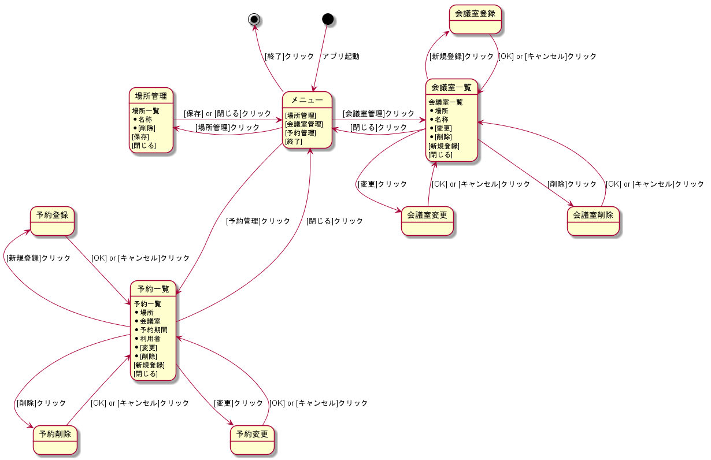
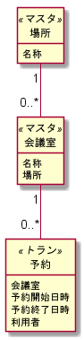
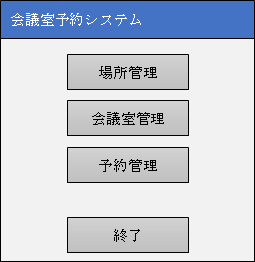
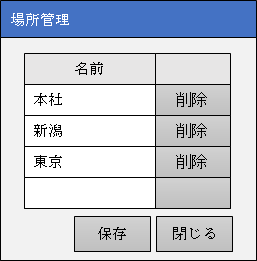
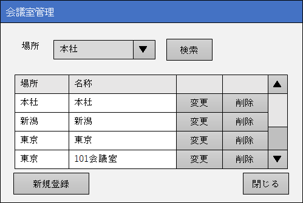
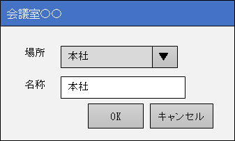
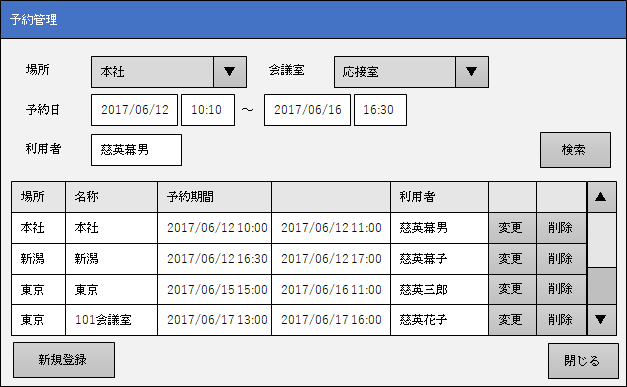
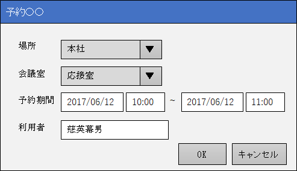

機能仕様書：会議室予約システム
=====

- 作成者 : 高野 将
- 作成日 : 2018/6/6

1.概要
-----

「会議室予約システム」は利用者と利用時間を指定して会議室を予約するためのプログラムである。 本プログラムは以下の4つの機能で構成される。

- メニュー  
  システムを起動すると最初に表示され、システムに含まれる機能を選択して起動する。
- 場所管理  
  予約対象の会議室が所属する「場所」を一覧形式で登録、参照、変更、削除する。
- 会議室管理  
  予約対象の会議室を一覧形式で参照し、サブ画面で登録、変更、削除を行う。
- 予約管理  
  予約情報を一覧形式で参照し、サブ画面で登録、変更、削除を行う。

場所、会議室、利用者、日時により予約情報の絞り込みも行える。

システムはプログラム言語としてC#を使い、Windowsフォームアプリケーションとして作成する。

### 画面遷移図

### データモデル

2.機能詳細
-----

### 2.1.メニュー

メニュー画面から各種機能を起動する。

#### 2.1.1.画面イメージ

 
#### 2.1.2.操作手順

使いたい機能に対応したボタンを押して、その機能を起動する。

#### 2.1.3.画面の動作

##### 起動時

アプリ起動時、画面の中央に表示される。

##### 業務機能起動

機能に対応したボタンを押すことで、各機能をサブ画面でモーダル表示する。

##### 終了

終了ボタンを押すことで、システムを終了する。

##### その他

画面サイズの変更はできない。

### 2.2.場所管理

場所管理画面で場所を一覧管理する。

#### 2.2.1.画面イメージ
 

#### 2.2.2.操作手順

グリッドで場所の名前を編集して、［保存］ボタンを押してデータを保存する。行を削除するには［削除］ボタンを押す。新たな行を追加するには、最終行に入力してEnterキーを押す。

#### 2.2.3.画面の動作

##### 起動時

メニューから起動されると、メニュー画面の中央に場所管理画面が表示される。グリッドには既存の場所データを名前順に取得して表示する。

##### グリッド最終行入力時

最終行は新規登録用に確保しておき、入力後にEnterキーを押すことで、行を追加できる。追加された行は、既存データ行と同様に削除ボタンを表示する。

##### ［削除］ボタンクリック時

クリックした行をグリッドから削除し、他のデータについては1行詰める。

##### ［保存］ボタンクリック時

場所データを全削除後、グリッド内のデータを先頭から登録する。

##### ［閉じる］ボタンクリック時

何もせずに画面を閉じる。

##### その他

画面サイズを変更すると、グリッドのサイズも合わせて変更される。また、［保存］、［閉じる］ボタンは右下に固定されるように移動する。

#### 2.2.4.入力チェック

以下のチェックを行いエラーがあったらその旨を通知して処理を中断する。

##### ［保存］ボタンクリック時

- 名称が入力されていない行があった場合、「名称を入力してください。」とメッセージを表示する。
- 同じ名前の行があった場合、2つ目以降に「同じ場所は複数登録できません。」とメッセージを表示する。

##### ［削除］ボタンクリック時

- その場所で既に会議室が登録されている場合、「会議室が登録されている場所は削除できません。」とメッセージを表示する。

### 2.3.会議室管理

会議室一覧画面で会議室を参照し、詳細画面で登録、変更、削除を行う。

#### 2.3.1.画面イメージ

##### 会議室一覧画面

 
##### 会議室詳細画面

 
ウィンドウタイトルは、新規登録時は「会議室登録」、変更時は「会議室変更」、削除時は「会議室削除」にする。

#### 2.3.2.操作手順

会議室一覧画面では、場所を指定して会議室を検索する。新たな会議室を追加するには［新規登録］ボタンを押す。既存の会議室を変更、削除するには、グリッド内の［変更］、［削除］ボタンを押す。

新規登録、変更、削除は会議室詳細画面で行い、OKを押すことでデータを更新できる。

#### 2.3.3.画面の動作

##### 起動時

メニューから起動されると、メニュー画面の中央に会議室一覧画面が表示される。

［場所］には、先頭に「なし」を表す空項目、その後登録済みの場所を名前順に設定する。初期値は「なし」を表示する。

グリッドは空で表示する。

##### ［検索］ボタンクリック時

選択した［場所］の会議室データを名称の昇順に取得し、グリッドに表示する。［場所］が「なし」の場合は全データを場所の昇順、名称の昇順で取得してグリッドに表示する。

##### ［新規登録］クリック時

会議室詳細画面を登録モードでモーダル表示する。

##### ［変更］クリック時

クリックした行の会議室データを、会議室詳細画面に変更モードでモーダル表示する。

##### ［削除］クリック時

クリックした行の会議室データを、会議室詳細画面に削除モードでモーダル表示する。また、［場所］と［名称］を変更できなくする。

##### ［閉じる］ボタンクリック時

何もせずに画面を閉じる。

##### 会議室詳細画面表示時

［場所］に登録済みの場所を名前順に設定する。

新規登録時は［場所］は選択なし、［名称］は空で表示する。

それ以外の場合、［場所］、［名称］に会議室一覧画面で選択した会議室データを設定する。

##### 会議室詳細画面［OK］ボタンクリック時

会議室データを新規登録時は新たに登録、変更時は変更、削除時は削除し、会議室詳細画面を閉じる。

会議室一覧画面に戻った後、［検索］されていれば再度検索を行い、会議室一覧のグリッドを最新化する。

##### 会議室詳細画面［キャンセル］ボタンクリック時

何もせずに会議室詳細画面を閉じる。

##### その他

画面サイズを変更すると、グリッドのサイズも合わせて変更される。また、［新規登録］ボタンは左下に、［閉じる］ボタンは右下に固定されるように移動する。［場所］および［検索］ボタンは移動せず、サイズも変更しない。

#### 2.3.4.入力チェック

以下のチェックを行いエラーがあったらその旨を通知して処理を中断する。

##### ［検索］ボタンクリック時

- 条件に該当する会議室がない場合、「選択した場所に会議室がありません。」と警告メッセージを表示する。

##### ［削除］ボタンクリック時

- その会議室で既に予約が登録されている場合、「予約が登録されている会議室は削除できません。」とメッセージを表示する。
##### 会議室詳細画面［OK］ボタンクリック時

- ［場所］が選択されていない場合、「会議室の場所を選択してください。」とメッセージを表示する。
- ［名称］が入力されていない場合、「会議室の名称を入力してください。」とメッセージを表示する。
- 入力された場所、名称がすでに登録済みの場合、「同じ名前の会議室が登録済みです。」とメッセージを表示する。

### 2.4.予約管理

予約一覧画面で予約情報を参照し、詳細画面で登録、変更、削除を行う。

#### 2.4.1.画面イメージ

##### 予約一覧画面

 
##### 予約詳細画面

 
ウィンドウタイトルは、新規登録時は「予約登録」、変更時は「予約変更」、削除時は「予約削除」にする。

#### 2.4.2.操作手順

予約一覧画面では、場所、会議室、予約日、利用者を指定して予約情報を検索する。新たな予約を追加するには［新規登録］ボタンを押す。既存の予約情報を変更、削除するには、グリッド内の［変更］、［削除］ボタンを押す。

新規登録、変更、削除は予約詳細画面で行い、OKを押すことでデータを更新できる。

#### 2.4.3.画面の動作

##### 起動時

メニューから起動されると、メニュー画面の中央に予約一覧画面が表示される。

［場所］には、先頭に「なし」を表す空項目、その後登録済みの場所を名前順に設定する。初期値は「なし」を表示する。

［会議室］は空で表示する。

［予約日］は開始、終了とも空で表示する。

［利用者］は空で表示する。

グリッドは空で表示する。

##### ［場所］変更時

先頭に「なし」を表す空項目、その後選択した場所の会議室を名前順に設定する。その後、初期値を「なし」に設定する。

［場所］が「なし」の場合は、［会議室］を空にする。

##### ［検索］ボタンクリック時

選択した［場所］、［会議室］、［予約日］、［利用者］の予約データを場所、会議室、予約開始日、予約終了日の昇順に取得し、グリッドに表示する。指定しなかった条件は検索時に無視する。

##### ［新規登録］クリック時

予約詳細画面を登録モードでモーダル表示する。

#####［変更］クリック時

クリックした行の予約データを、予約詳細画面に変更モードでモーダル表示する。

##### ［削除］クリック時

クリックした行の予約データを、予約詳細画面に削除モードでモーダル表示する。また、［場所］、［会議室］、［予約期間］、［利用者］を変更できなくする。

##### ［閉じる］ボタンクリック時

何もせずに画面を閉じる。

##### 予約詳細画面表示時

［場所］に登録済みの場所を名前順に設定する。

新規登録時は［場所］、［会議室］は選択なし、［予約期間］は開始、終了日とも当日を設定、開始、終了時間は空、［利用者］は空で表示する。

それ以外の場合、予約一覧画面で選択した予約データを元に、［場所］、［会議室］、［予約期間］、［利用者］を設定する。また、予約データの場所に登録された会議室を、名前順に［会議室］の項目として設定する。

##### 予約詳細画面［場所］変更時

選択した場所の会議室を名前順に設定する。その後、初期値を「なし」に設定する。

##### 予約詳細画面［OK］ボタンクリック時

予約データを新規登録時は新たに登録、変更時は変更、削除時は削除し、予約詳細画面を閉じる。

予約一覧画面に戻った後、［検索］されていれば再度検索を行い、予約一覧のグリッドを最新化する。

##### 予約詳細画面［キャンセル］ボタンクリック時

何もせずに予約詳細画面を閉じる。

##### その他

画面サイズを変更すると、グリッドのサイズも合わせて変更される。また、［新規登録］ボタンは左下に、［閉じる］ボタンは右下に固定されるように移動する。［場所］から［検索］ボタンまでの検索条件部分は移動せず、サイズも変更しない。

#### 2.4.4.入力チェック

以下のチェックを行いエラーがあったらその旨を通知して処理を中断する。

##### 予約一覧画面［検索］ボタンクリック時

- ［予約開始日］がyyyy/M/d形式の日付でない場合、「日付を2017/6/12のような形式で入力して下さい。」とメッセージを表示する。
- ［予約開始時間］がH:m形式の時刻でない場合、「時刻を14:25のような形式で入力してください。」とメッセージを表示する。
- ［予約開始日］と［予約開始時間］のどちらか一方のみが入力された場合、「日付と時刻は一緒に入力してください。」とメッセージを表示する。
- ［予約終了日］がyyyy/M/d形式の日付でない場合、「日付を2017/6/12のような形式で入力して下さい。」とメッセージを表示する。
- ［予約終了時間］がH:m形式の時刻でない場合、「時刻を14:25のような形式で入力してください。」とメッセージを表示する。
- ［予約終了日］と［予約終了時間］のどちらか一方のみが入力された場合、「日付と時刻は一緒に入力してください。」とメッセージを表示する。

##### 予約詳細画面［OK］ボタンクリック時

- ［場所］が選択されていない場合、「場所を選択してください。」とメッセージを表示する。
- ［会議室］が選択されていない場合、「会議室を選択してください。」とメッセージを表示する。
- ［予約開始日］が入力されていない場合、「予約開始日を入力してください。」とメッセージを表示する。
- ［予約開始日］がyyyy/M/d形式の日付でない場合、「日付を2017/6/12のような形式で入力して下さい。」とメッセージを表示する。
- ［予約開始時間］が入力されていない場合、「予約開始時間を入力してください。」とメッセージを表示する。
- ［予約開始時間］がH:m形式の時刻でない場合、「時刻を14:25のような形式で入力してください。」とメッセージを表示する。
- ［予約終了日］が入力されていない場合、「予約終了日を入力してください。」とメッセージを表示する。
- ［予約終了日］がyyyy/M/d形式の日付でない場合、「日付を2017/6/12のような形式で入力して下さい。」とメッセージを表示する。
- ［予約終了時間］が入力されていない場合、「予約終了時間を入力してください。」とメッセージを表示する。
- ［予約終了時間］がH:m形式の時刻でない場合、「時刻を14:25のような形式で入力してください。」とメッセージを表示する。
- 予約期間（※）が1分未満なら「予約期間が無効です。」とメッセージを表示する。  
    ※予約期間：
    ［予約終了日］、［予約終了時間］の日時から［予約開始日］、［予約開始時間］の日時を引いた期間  
    例）2017/6/10 10:00 – 2017/6/11 11:30 = 25時間30分
- ［利用者］が入力されていない場合、「利用者を入力してください。」とメッセージを表示する。
- 同じ会議室に指定した予約期間が重なる予約が登録されていた場合、「期間の重なる予約が既に登録されています。」とメッセージを表示する。
